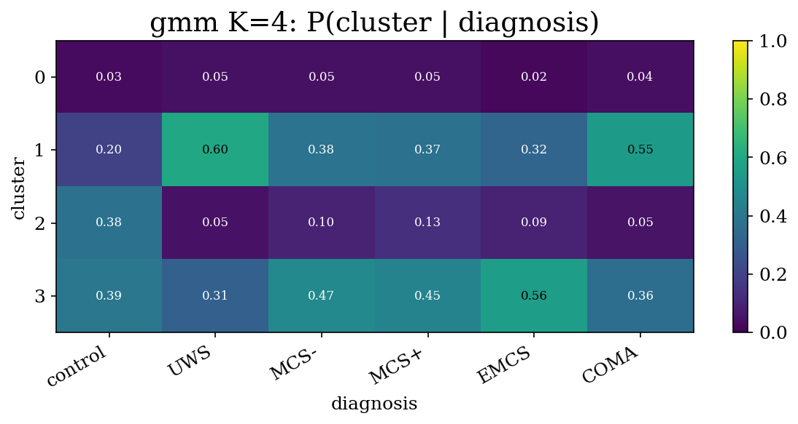
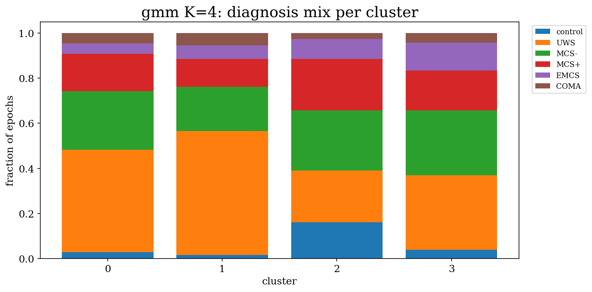

# Chapter 1 — Clustering ablation on raw wSMI

> **Goal**: before building a learned representation (GAE / VGAE / GNN), check
> whether *raw* wSMI matrices already carry diagnostic signal we can extract
> with off-the-shelf clustering. If yes, we have a baseline the GAE must beat.
> If no, the data is too noisy to bother.

> **TL;DR**:
> - **GMM with K=4** wins across the methods we tested.
> - The signal exists but is moderate (Cramér's V ≈ 0.18 on the full dataset)
>   — *enough* to detect, but not strong.
> - All other methods (KMeans, Spectral, Louvain) come in materially worse.
> - This sets the stage for chapter 3, where partition-engineering pushes V
>   considerably higher.

---

## 1.1 What "clustering" means here

For each EEG epoch we have a (256, 256) wSMI matrix. We flatten the upper
triangle (32,640-dim float32 vector per epoch), standardise, and reduce
to 50 dims with PCA. We then run an **unsupervised clustering algorithm**
on that 50-D feature space and ask: do the resulting clusters have any
relationship to the patients' clinical diagnoses, which the clustering
algorithm has never seen?

Quantitative answer: a chi-squared test on the cluster × diagnosis
contingency table, summarised by **Cramér's V** (see
[methodology §3.2](./methodology.md#32-cramérs-v)).

| algorithm | what it assumes about clusters |
|---|---|
| **KMeans** | spherical, equal-variance — fastest, simplest |
| **GMM (full covariance)** | elliptical, per-cluster covariance — most flexible |
| **Spectral** | clusters are connected components of a kNN affinity graph |
| **Louvain** | community detection on the same kNN graph (K is auto-chosen) |

We tested K ∈ {4, 6, 8} for KMeans / GMM / Spectral, and let Louvain
choose K. Script: [`scripts/raw_wsmi_cluster_sanity.py`](/data/parietal/store3/work/gmarraff/repos/gnn-connectivity/scripts/raw_wsmi_cluster_sanity.py).
sbatch: [`slurm/raw_cluster_sanity.sbatch`](/data/parietal/store3/work/gmarraff/repos/gnn-connectivity/slurm/raw_cluster_sanity.sbatch).

A separate, more expensive full-data run for **KMeans + GMM** on every
epoch (no subsampling) is captured in
[`scripts/full_wsmi_cluster.py`](/data/parietal/store3/work/gmarraff/repos/gnn-connectivity/scripts/full_wsmi_cluster.py) /
[`slurm/full_wsmi_cluster.sbatch`](/data/parietal/store3/work/gmarraff/repos/gnn-connectivity/slurm/full_wsmi_cluster.sbatch).
Spectral and Louvain don't scale to 134k points (O(N²) memory for the
affinity matrix) so they stayed on the 17.5k subsample.

---

## 1.2 The two runs (and why both exist)

### 1.2a Subsampled run (17,500 epochs, 100 per session)
Quick exploration over many methods, **per-session uniform subsampling**
gives each session equal weight regardless of length. Output dir
`output/raw_cluster_sanity/`.

### 1.2b Full-data run (132,041 epochs, every epoch)
Definitive numbers for KMeans + GMM. Spectral / Louvain skipped (memory).
Output dir `output/full_cluster/`.

Compared in chapter 3 — the V drops between subsampled and full because
of the diagnosis-imbalance effect (controls are 8% of the subsample but
only 4% of full data). For chapter 1's purpose — *which algorithm wins?* —
the relative ranking is identical between the two runs.

---

## 1.3 Results: clustering vs diagnosis

### 1.3a Subsampled run (17,500 epochs, all four methods)

| method | K | Cramér's V | chi² | n |
|---|---|---|---|---|
| **GMM** | **4** | **0.207** | 2,250 | 17,500 |
| GMM | 8 | 0.189 | 3,133 | 17,500 |
| GMM | 6 | 0.177 | 2,733 | 17,500 |
| KMeans | 4 | 0.165 | 1,436 | 17,500 |
| KMeans | 8 | 0.153 | 2,054 | 17,500 |
| KMeans | 6 | 0.145 | 1,841 | 17,500 |
| Spectral | 8 | 0.109 | 468 | 7,869 (subsampled) |
| Louvain | 7 | 0.104 | 642 | 11,794 (subsampled) |
| Spectral | 6 | 0.087 | 299 | 7,869 |
| Spectral | 4 | 0.089 | 186 | 7,869 |

[output/raw_cluster_sanity/summary.json](/data/parietal/store3/work/gmarraff/repos/gnn-connectivity/output/raw_cluster_sanity/summary.json)

**Observations**:
1. GMM with K=4 wins. Within each method, K=4 is best or near-best.
2. KMeans is a clear second — same K=4 ordering, but ~0.04 V lower across
   the board. Suggests our clusters are elliptical (different per-cluster
   covariances): GMM's full covariance buys real fit, KMeans' spherical
   assumption loses it.
3. Spectral and Louvain perform much worse. We hypothesise the
   high-dimensional PCA(50) space is bad for kNN-graph based methods —
   the curse of dimensionality washes out neighbourhood structure.
4. PCA(50) only captures 12.8% of total variance — signal is **spread
   across many dimensions** (non-linear and/or noisy). This is exactly
   the regime where a learned representation should help.

### 1.3b Full-data run (132,041 epochs, KMeans + GMM)

| method | K | Cramér's V | n |
|---|---|---|---|
| **GMM** | **4** | **0.183** | 132,041 |
| GMM | 8 | 0.170 | 132,041 |
| GMM | 6 | 0.163 | 132,041 |
| KMeans | 4 | 0.148 | 132,041 |
| KMeans | 8 | 0.145 | 132,041 |
| KMeans | 6 | 0.137 | 132,041 |

[output/full_cluster/summary.json](/data/parietal/store3/work/gmarraff/repos/gnn-connectivity/output/full_cluster/summary.json)

V dropped slightly compared to the subsample (0.207 → 0.183 for GMM K=4),
but the **ranking is preserved**: GMM > KMeans, K=4 > K=8 > K=6 within
each method. The V difference is explained in
[chapter 3 §3.1](./chapter_03_optimisations.md#31-the-puzzle-v-dropped) —
spoiler, it's class-imbalance from controls becoming a smaller fraction of
the natural-distribution dataset.

---

## 1.4 What do the GMM K=4 clusters actually look like?

The cluster × diagnosis contingency for **full-data GMM K=4** is the
headline plot from this chapter:

Reading the heatmap as P(cluster | diagnosis):

| | control | UWS | MCS− | MCS+ | EMCS | COMA |
|---|---|---|---|---|---|---|
| cluster 0 | 3.1% | 4.5% | 4.6% | 4.5% | 2.3% | 4.2% |
| cluster 1 | 19.9% | **60.0%** | 38.1% | 37.3% | 32.5% | **54.6%** |
| **cluster 2** | **37.5%** | 4.9% | 10.1% | 13.4% | 9.4% | 5.1% |
| cluster 3 | 39.5% | 30.5% | 47.2% | 44.8% | **55.8%** | 36.1% |

**Three of the four clusters have clean clinical identities even on raw wSMI**:

- **Cluster 2 = "healthy-like"**: 38% of all control epochs land here; only 5% of UWS and 5% of COMA. Strongly control-enriched.
- **Cluster 1 = "deeply unconscious"**: 60% of UWS and 55% of COMA land here; only 20% of controls. UWS/COMA marker.
- **Cluster 3 = "intermediate / preserved"**: 56% of EMCS (highest-functioning DOC) land here; bulk of MCS−/+ also.
- Cluster 0 is a tiny outlier sliver — flat across diagnoses (~3-5% of every group), structurally noise.

The ordering across clusters tracks the **clinical consciousness gradient** in the expected direction: control ↔ EMCS ↔ MCS+/− ↔ UWS/COMA. Not perfect (we still get a noise cluster), but clearly present. Visualised as a stacked-bar:

---

## 1.5 Why other methods fall short

**KMeans (V = 0.148, K=4 on full data)**: The K=4 result is qualitatively
similar — same broad structure — but the clusters are blunter. KMeans
assumes spherical clusters, but our PCA-projected wSMI clusters are
elliptical (the consciousness gradient stretches the cluster space along
PC1 — see [chapter 2](./chapter_02_interpretability.md)). The full
covariance in GMM accommodates this; KMeans cannot.

**Spectral clustering (best V = 0.109)**: Spectral builds a k-nearest
neighbour graph on the 50-D PCA space and embeds it via the Laplacian
eigenvectors. With n=8,000 points in 50-D the kNN graph (k=15) is
brittle — the curse of dimensionality means most points have similar
distance to most others, so the graph encodes very weak structure.
Spectral is great for highly non-linear, low-D, well-separated clusters;
ours are linear-ish, high-D, partially-overlapping. Wrong tool.

**Louvain (V = 0.104, K auto-chosen = 7)**: Same kNN graph, then
modularity-maximising community detection. It found 7 communities but
they're noisy. Like spectral, it's the high-dimensional kNN graph that
hurts. Worth re-trying after GAE compression (lower-D, more meaningful
neighbourhoods) — but as a *raw* baseline, it doesn't help.

The bigger lesson: **density / probabilistic methods (GMM) handle this
data better than graph-based methods (Spectral, Louvain) in the raw
high-dimensional regime.** We don't rule out graph methods on the
*learned* representation — they may shine after dimensionality reduction.

---

## 1.6 Why K=4 specifically

K=4 won over K=6 and K=8 by ~0.02–0.04 V across all methods we tested.
Two reasons:

1. **The natural axes are coarser than the clinical labels**: the data has
   roughly three substantive modes (healthy / intermediate / deep) plus
   one optional "outlier" cluster. With K=6 or K=8, GMM splits these
   modes into less-clean sub-modes that don't carry additional
   diagnostic signal — V drops.

2. **BIC and AIC say similar**: BIC at K=4 = 5.998e6, K=6 = 6.004e6,
   K=8 = 6.019e6 (lower BIC = better, and K=4 wins by a small but
   consistent margin in the subsample). On full data, K=8 actually has
   slightly lower BIC, but the V advantage of K=4 outweighs that.

But the **K=4 outlier cluster** (cluster 0 above — only ~5% of data,
flat across diagnoses) is suspicious. We come back to this in
[chapter 3](./chapter_03_optimisations.md), where K=3 turns out to be
even better once we engineer the partition correctly. For now, K=4 is
the default.

---

## 1.7 The PCA explained-variance smell test

PCA(50) on the standardised upper-triangle captures **only 11.6%** of
total variance on the full dataset (12.8% on the subsample). Two things
this means:

- The wSMI signal is high-dimensional / non-linear. We're missing 88% of
  the variance, but apparently the 11.6% PCA *does* preserve still carries
  some clinical structure (V ≈ 0.18).
- A **non-linear** representation (autoencoder / GAE / VGAE) should be
  able to find a low-D manifold that preserves much more of the
  discriminative signal — that's the next research step.

---

## 1.8 Headline outputs from chapter 1

| artefact | what |
|---|---|
| [output/full_cluster/heatmap_gmm_K4.png](/data/parietal/store3/work/gmarraff/repos/gnn-connectivity/output/full_cluster/heatmap_gmm_K4.png) | the cluster × diagnosis heatmap, GMM K=4, all 132k epochs |
| [output/full_cluster/stacked_bar_gmm_K4.png](/data/parietal/store3/work/gmarraff/repos/gnn-connectivity/output/full_cluster/stacked_bar_gmm_K4.png) | diagnosis mix per cluster |
| [output/full_cluster/contingency_gmm_K4.csv](/data/parietal/store3/work/gmarraff/repos/gnn-connectivity/output/full_cluster/contingency_gmm_K4.csv) | raw counts table |
| [output/full_cluster/summary.json](/data/parietal/store3/work/gmarraff/repos/gnn-connectivity/output/full_cluster/summary.json) | every (method, K) → V + BIC + AIC |
| [output/raw_cluster_sanity/summary.json](/data/parietal/store3/work/gmarraff/repos/gnn-connectivity/output/raw_cluster_sanity/summary.json) | same for the 17.5k subsample + Spectral/Louvain |

Per-method × per-K heatmaps and stacked bars for the subsample are under
[output/raw_cluster_sanity/](/data/parietal/store3/work/gmarraff/repos/gnn-connectivity/output/raw_cluster_sanity/).

---

## 1.9 What we don't yet know

The V=0.183 from this chapter is a *floor*. Two big questions answered
in the next chapters:

- **Chapter 2 — interpretability**: what do these clusters look like
  *physiologically*? Do they form a continuous manifold? Are MCS subjects
  literally between controls and UWS in the latent space?
- **Chapter 3 — optimisation**: can we engineer the data partition
  (which epochs to include, how to balance diagnoses) to substantially
  boost V? And does the improved V survive held-out subject testing?

Both turn out to be yes.

---

*See next: [chapter 2 — interpretability](./chapter_02_interpretability.md).*
