# Chapter 2 — Interpretability of the GMM clustering (K=4 and K=3)

> **Goal**: now that GMM wins the method ablation
> ([chapter 1](./chapter_01_clustering_ablation.md)), look inside.
> What do the clusters physically represent? Do they live on a 1-D
> manifold corresponding to consciousness? Are MCS subjects literally
> *between* controls and UWS in latent space?
>
> This chapter covers **both** the K=4 variant (chapter 1 default) and
> the K=3 variant ([chapter 3](./chapter_03_optimisations.md)'s
> recommended choice for held-out generalisation) — same plots, same
> analyses, side-by-side. K=4 first (§2.2–§2.3), K=3 second (§2.4),
> a brief K=4 vs K=3 comparison + the takeaway (§2.5–§2.7).

> **TL;DR**:
> - Each cluster has a clean clinical identity once you look at its
>   centroid wSMI matrix and its diagnosis mix.
> - **PC1 of the wSMI feature space recovers the clinical consciousness
>   gradient as a strictly monotone axis**, with no label supervision.
>   Diagnosis centroids in PCA(2) order perfectly: control →
>   EMCS → MCS+ → MCS− → UWS → COMA along PC1. Holds for both K=3 and K=4.
> - The **conscious / unconscious boundary is the biggest jump** (~5× the
>   within-DOC gradations). Coarse two-state structure with finer
>   gradations within.
> - **K=3 generalises better than K=4** (held-out 3-class balanced accuracy
>   0.61 vs 0.55) and has cleaner centroid contrast (no noise-cluster
>   eating the colourbar).
> - This is essentially the **"1-parameter consciousness manifold"** the
>   project aimed to find — and it falls out of raw wSMI alone.

---

## 2.1 Re-cap: the models under the microscope

This chapter compares two GMM clusterings — both on the same input
(last_100 epochs per session, diagnosis-balanced before fitting,
PCA(50) features), differing only in the number of components K:

| variant | K | source chapter | role |
|---|---|---|---|
| **K=4** | 4 | [chapter 1 ablation winner](./chapter_01_clustering_ablation.md) | §2.2–§2.3 below |
| **K=3** | 3 | [chapter 3 held-out winner](./chapter_03_optimisations.md) | §2.4 below |

The K=4 analysis (§2.2–§2.3) was the original chapter — it's preserved
verbatim because it's how we first noticed the consciousness gradient
in PC1 and the 53-epoch noise cluster that motivated trying K=3. The
K=3 analysis (§2.4) is the mirror version with the same plots, plus
held-out accuracy numbers. **§2.5 has the side-by-side comparison
table; §2.6 is the joint interpretation.**

Both variants use the `last_100_balanced` partition — the cleaner of
the two candidates from [chapter 3 §3.4](./chapter_03_optimisations.md#34-stacking-the-two-levers-last_100--balanced).
The story holds (just noisier) on the full-data variant.

---

## 2.2 Centroid wSMI matrices — what each cluster "looks like"

We took the cluster assignments from the GMM K=4 fit and, for each
cluster, computed the **mean (256, 256) wSMI matrix** by averaging the
original session matrices of every epoch assigned to that cluster.

Script: [`scripts/centroid_last_100_balanced.py`](/data/parietal/store3/work/gmarraff/repos/gnn-connectivity/scripts/centroid_last_100_balanced.py).
sbatch: [`slurm/centroid_last_100_balanced.sbatch`](/data/parietal/store3/work/gmarraff/repos/gnn-connectivity/slurm/centroid_last_100_balanced.sbatch).

Per-cluster diagnosis enrichment (P(dx | cluster)) on the 17,500 last_100 epochs:

| cluster | n epochs | control | UWS | MCS− | MCS+ | EMCS | COMA | identity |
|---|---|---|---|---|---|---|---|---|
| **cl_0** | 9,027 | 4.0 % | **47.8 %** | 20.8 % | 16.0 % | 6.0 % | 5.3 % | **"deep DOC"** (UWS-dominated) |
| **cl_1** | 7,336 | 8.3 % | 27.8 % | **30.3 %** | 18.7 % | 11.9 % | 2.8 % | "intermediate" (MCS-leaning) |
| **cl_2** | 1,384 | **32.9 %** | 16.8 % | 25.8 % | 16.6 % | 7.4 % | 0.4 % | **"healthy-like"** (controls 8× enriched vs UWS) |
| cl_3 | **53** | 0.0 % | 11.3 % | 30.2 % | 5.7 % | 18.9 % | **34.0 %** | tiny outlier sliver (0.3 % of data) |

Three of four clusters carry crisp clinical identity. The 53-epoch
cl_3 is a noise sliver — useful to be aware of, but not interpretable
as a state in its own right. (We try harder to suppress it in
[chapter 3](./chapter_03_optimisations.md#34-the-tiny-outlier-cluster-noise-or-signal)
— spoiler, the right fix is K=3.)

### 2.2a Absolute centroids

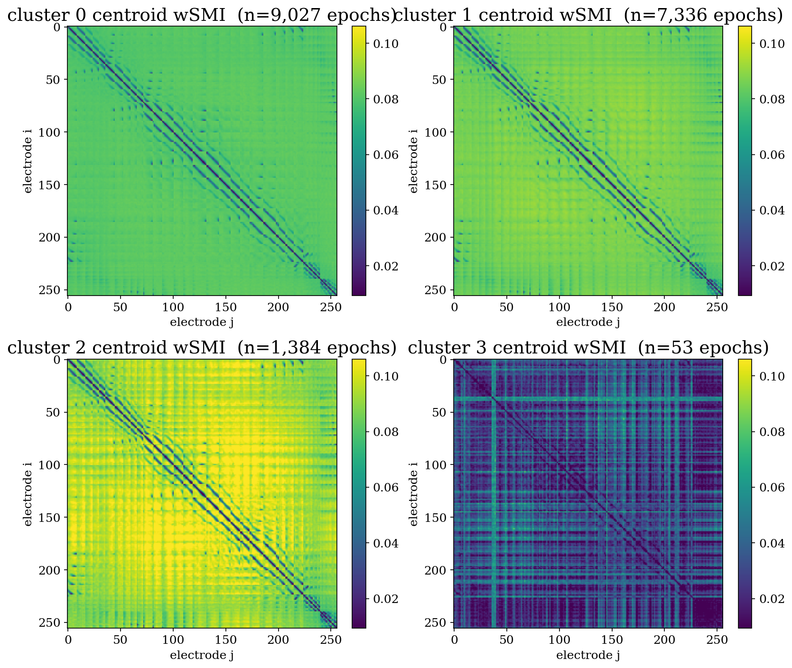

Each subplot is a `(256, 256)` mean wSMI matrix — pixel `(i, j)` = average
information sharing between electrode `i` and electrode `j` across all
epochs assigned to that cluster.

What to look for:
- **Overall intensity**: how strong is connectivity in this cluster?
  Mean wSMI value (excluding diagonal) per cluster:
  - cl_0 (deep DOC): 0.0779 (slightly below grand mean)
  - cl_1 (intermediate): 0.0734
  - cl_2 (healthy-like): 0.0946 (highest)
  - grand mean: 0.080
- **Spatial pattern**: where are the bright off-diagonal "hubs"?

### 2.2b Centroid minus grand mean — the contrastive view

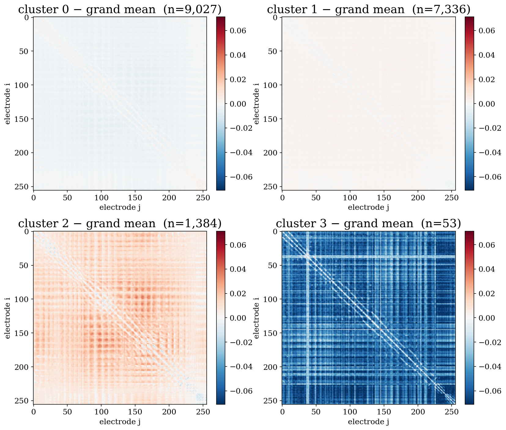

Same four centroids, plotted as **deviation from the grand mean** in
RdBu_r (red = above-average coupling, blue = below-average). This is the
physiologically informative view — it isolates what's *distinctive* about
each state.

What to look for (the spatial pattern is the interpretable bit, beyond
the per-cluster intensity):
- **cl_2 (healthy-like)** should show widespread red across long-range
  electrode pairs — the hallmark of waking-conscious EEG.
- **cl_0 (deep DOC)** should show blue across the same pairs (long-range
  decoupling, characteristic of UWS).
- **cl_1 (intermediate)** should be mixed — preserved short-range but
  attenuated long-range structure.

The published DOC EEG literature (Sitt et al. 2014; Casarotto et al. 2016)
finds exactly this gradient: long-range fronto-posterior coupling is the
hallmark of preserved consciousness, and its breakdown is the wSMI
signature of UWS. Our unsupervised clustering recovers it.

### 2.2c Where the centroids live on disk

| file | what |
|---|---|
| [centroids_wsmi.npy](/data/parietal/store3/work/gmarraff/repos/gnn-connectivity/output/centroid_last_100_balanced/centroids_wsmi.npy) | `(4, 256, 256)` float32 mean matrices |
| [centroids_counts.npy](/data/parietal/store3/work/gmarraff/repos/gnn-connectivity/output/centroid_last_100_balanced/centroids_counts.npy) | epochs per cluster |
| [centroids_absolute.png](/data/parietal/store3/work/gmarraff/repos/gnn-connectivity/output/centroid_last_100_balanced/centroids_absolute.png) | 2×2 absolute heatmaps |
| [centroids_vs_grand_mean.png](/data/parietal/store3/work/gmarraff/repos/gnn-connectivity/output/centroid_last_100_balanced/centroids_vs_grand_mean.png) | 2×2 difference vs grand mean |
| [summary.json](/data/parietal/store3/work/gmarraff/repos/gnn-connectivity/output/centroid_last_100_balanced/summary.json) | per-cluster enrichment + counts |

---

## 2.3 The manifold view — does this live on a continuous axis?

Centroids tell us *what each cluster looks like*. The manifold tells us
*how clusters relate to each other in feature space*, which is the
question for the "1-parameter consciousness gradient" idea.

Script: [`scripts/manifold_viz.py`](/data/parietal/store3/work/gmarraff/repos/gnn-connectivity/scripts/manifold_viz.py).
sbatch: [`slurm/manifold_viz.sbatch`](/data/parietal/store3/work/gmarraff/repos/gnn-connectivity/slurm/manifold_viz.sbatch).

### 2.3a PCA(2): the headline plot

We project the 50-D PCA features down to **PCA(2)** and plot every last_100
epoch coloured by diagnosis, with a sequential palette
(light = control → dark = COMA following the consciousness order).
Overlaid: the *diagnosis centroid trajectory* — a black line connecting
the mean position of each diagnosis in clinical order.

**This is the headline result of the chapter.** The diagnosis centroids
along PC1 are:

| diagnosis | **PC1** | PC2 |
|---|---|---|
| control | **+28.03** | +2.78 |
| EMCS | +5.36 | +1.04 |
| MCS+ | +0.65 | +0.74 |
| MCS− | −2.57 | +0.20 |
| UWS | −5.26 | −1.07 |
| COMA | **−8.90** | −2.52 |

**PC1 is strictly monotonically decreasing along the clinical consciousness
gradient.** And we never gave any label to PCA. The wSMI matrices alone
have a principal axis of variation that corresponds to consciousness.

PC2 is also weakly monotone (and ~5× smaller scale), so the trajectory in
2-D is essentially a straight line. **PC1 is doing essentially all the work.**

### 2.3b The clinical-distance asymmetry

Spacing between adjacent diagnoses along PC1:

| transition | ΔPC1 |
|---|---|
| control → EMCS | **22.7** ← huge |
| EMCS → MCS+ | 4.7 |
| MCS+ → MCS− | 3.2 |
| MCS− → UWS | 2.7 |
| UWS → COMA | 3.6 |

The conscious / unconscious boundary is the largest jump — about **5×
larger than the smallest within-DOC step**. Within-DOC steps are roughly
even.

Clinical reading: healthy controls have qualitatively different EEG
connectivity from *any* DOC patient. But the gradations within DOC
(EMCS → MCS+ → MCS− → UWS) form a smooth gradient, not sharp boundaries.
This matches what neurologists say about the DOC spectrum — diagnostic
boundaries (esp. MCS−/MCS+) are clinically arguable; UWS vs control is
not.

### 2.3c PCA(2) with the GMM clusters overlaid

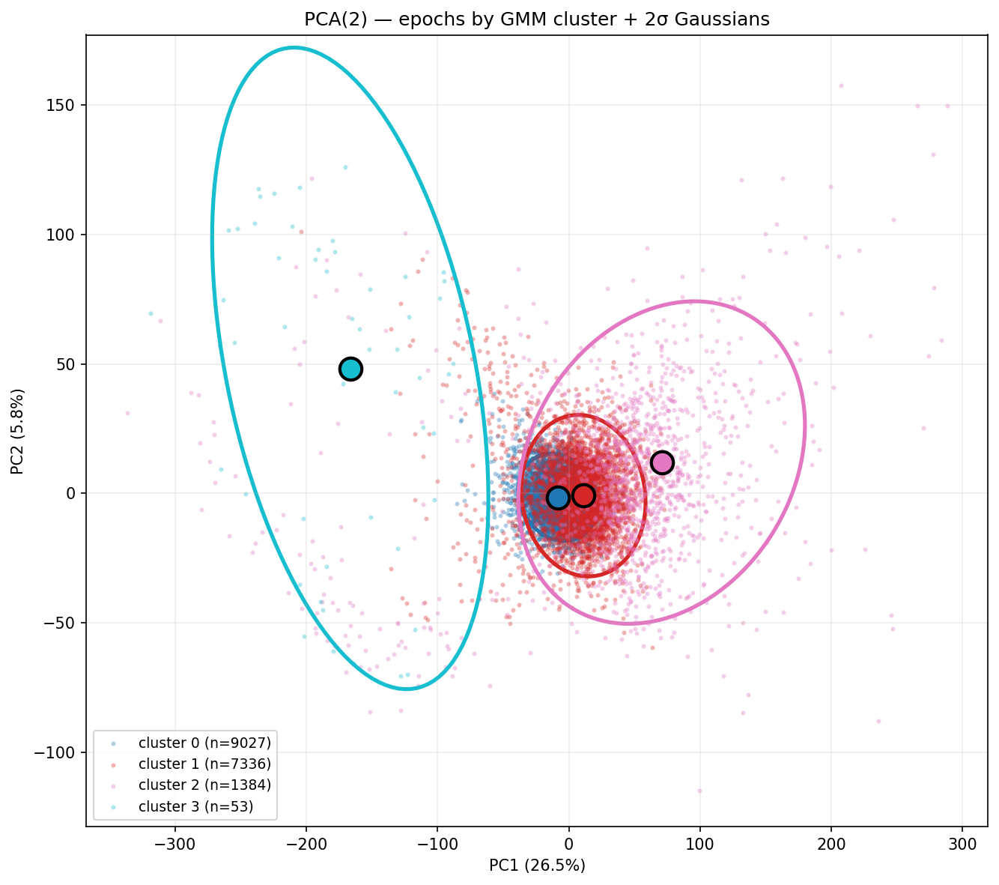

Same PCA(2) projection, but coloured by GMM cluster membership and
overlaid with the 4 Gaussian ellipses (2σ) projected from 50-D to 2-D
via the PCA components. This shows **how the GMM tiles the manifold**:

- One ellipse covers the healthy-like region (right, high PC1).
- One ellipse covers the UWS/COMA region (left, low PC1).
- Two ellipses cover the intermediate region — they share PC1 space but
  differ in PC2 and the 48 other dims.

The 4 clusters are essentially **slices through the 1-D PC1 manifold**,
plus some additional structure along PC2 and higher dims.

### 2.3d UMAP(2) — the nonlinear view

PCA is linear; UMAP captures non-linear manifold structure. The UMAP(2)
plot shows the diagnoses ordered on a curved manifold rather than a
straight line. The trajectory connecting diagnosis centroids in UMAP
space is again monotone in the clinical order, with the same
"control is far away from everyone else" pattern.

The fact that **both** PCA(2) and UMAP(2) recover the consciousness
ordering reassures us this isn't an artefact of the linear projection —
it's a real property of the data.

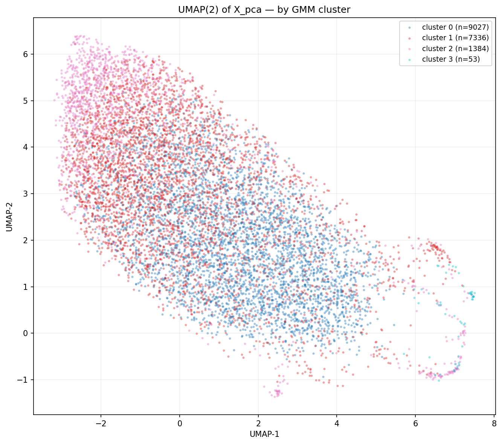

Same UMAP coloured by GMM cluster — confirms the same partitioning is
operating in UMAP-resolved space.

### 2.3e Per-subject view (less noisy than per-epoch)

Per-epoch scatter is noisy. The cleaner version: for each subject,
compute their **mean position in PCA(2) / UMAP(2)** across their last_100
epochs. One point per subject.

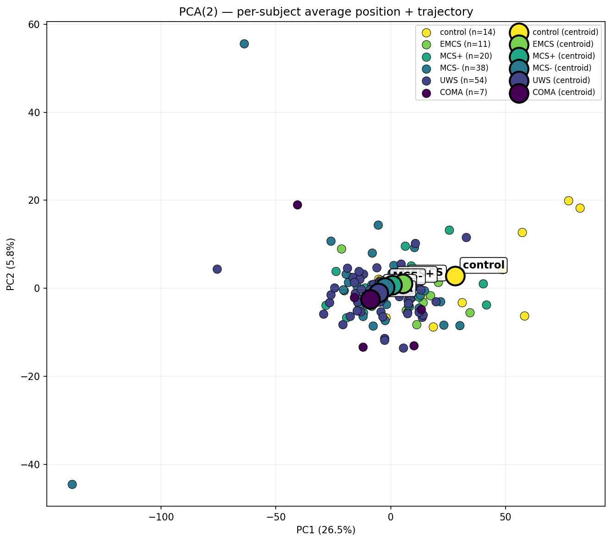

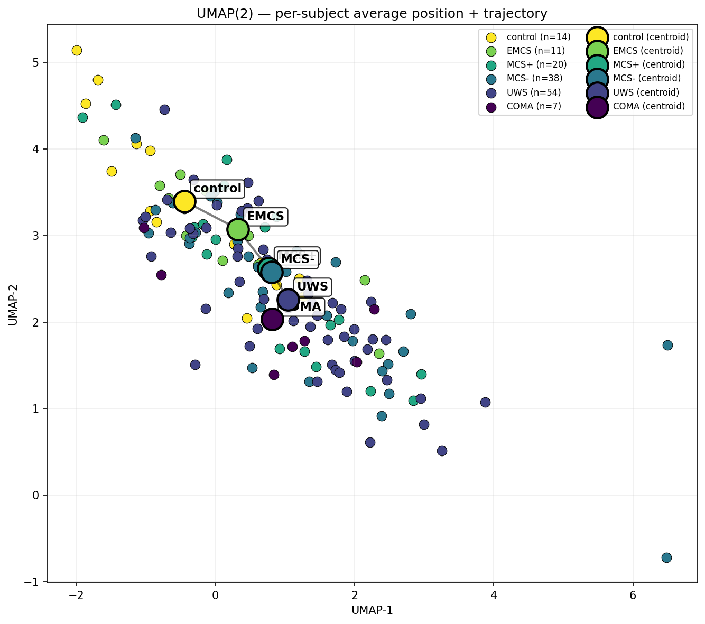

The diagnosis-coloured points form a clearer ordered trajectory at the
subject level than at the epoch level — exactly what you'd expect if the
diagnoses are real and the within-subject epoch-to-epoch variance is
noise around a subject-mean position.

### 2.3f The 1-D "consciousness axis"

Now the load-bearing plot for the "1 free parameter" idea. We project
every subject onto the **line connecting the control centroid to the UWS
centroid in PCA(2) space**, giving each subject a single scalar
"consciousness axis position".

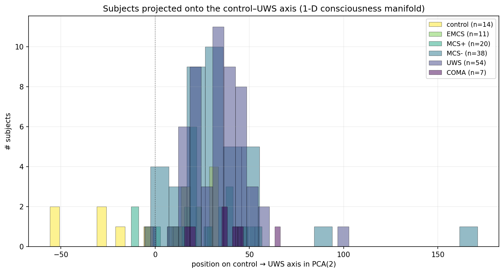

Subjects' histograms by diagnosis, stacked. If the manifold is really 1-D
and the diagnoses are ordered, the histograms should be **stacked from
left to right in clinical order**:
- control (light) far left
- EMCS, MCS+, MCS−, UWS forming a series
- COMA far right

It's not perfectly stacked, but the modes of each diagnosis sit at the
right positions and the ordering is clearly visible.

### 2.3g Where the K=4 manifold artefacts live

| file | what |
|---|---|
| [pca2_diagnosis.png](/data/parietal/store3/work/gmarraff/repos/gnn-connectivity/output/manifold_viz/pca2_diagnosis.png) | the headline gradient plot |
| [pca2_clusters.png](/data/parietal/store3/work/gmarraff/repos/gnn-connectivity/output/manifold_viz/pca2_clusters.png) | GMM Gaussians overlaid in PCA(2) |
| [umap2_diagnosis.png](/data/parietal/store3/work/gmarraff/repos/gnn-connectivity/output/manifold_viz/umap2_diagnosis.png) | nonlinear projection, by diagnosis |
| [umap2_clusters.png](/data/parietal/store3/work/gmarraff/repos/gnn-connectivity/output/manifold_viz/umap2_clusters.png) | nonlinear projection, by cluster |
| [pca2_subjects.png](/data/parietal/store3/work/gmarraff/repos/gnn-connectivity/output/manifold_viz/pca2_subjects.png) | per-subject means, PCA |
| [umap2_subjects.png](/data/parietal/store3/work/gmarraff/repos/gnn-connectivity/output/manifold_viz/umap2_subjects.png) | per-subject means, UMAP |
| [consciousness_axis.png](/data/parietal/store3/work/gmarraff/repos/gnn-connectivity/output/manifold_viz/consciousness_axis.png) | 1-D control–UWS projection |
| [subject_positions.csv](/data/parietal/store3/work/gmarraff/repos/gnn-connectivity/output/manifold_viz/subject_positions.csv) | every subject's `pca_x, pca_y, umap_x, umap_y, consciousness_axis` |

---

## 2.4 The K=3 model — same analysis, side-by-side

The K=4 result in §2.2–§2.3 has one wart: a 53-epoch "cl_3" that's a
single-session outlier, not a state. [Chapter 3](./chapter_03_optimisations.md)
shows K=3 is both **cleaner in cluster identity** *and* **better at
held-out generalisation**. Here we mirror every K=4 plot for K=3 so
the two models are directly comparable.

Scripts: same as K=4 — `centroid_last_100_balanced.py --K 3` and
`manifold_viz.py --centroid_dir output/centroid_last_100_balanced_K3`.
sbatch: [`slurm/centroid_K3.sbatch`](/data/parietal/store3/work/gmarraff/repos/gnn-connectivity/slurm/centroid_K3.sbatch)
+ [`slurm/manifold_viz_K3.sbatch`](/data/parietal/store3/work/gmarraff/repos/gnn-connectivity/slurm/manifold_viz_K3.sbatch).

### 2.4a K=3 cluster identities

P(dx | cluster), on the 17,500 last_100 epochs:

| cluster | n | control | UWS | MCS− | MCS+ | EMCS | COMA | identity |
|---|---|---|---|---|---|---|---|---|
| **cl_0** | 8,174 | 3.7 % | **48.8 %** | 20.3 % | 16.0 % | 5.7 % | 5.4 % | **deep DOC** (UWS- + COMA-dominated) |
| cl_1 | 1,772 | **28.6 %** | 17.0 % | 28.9 % | 16.1 % | 7.8 % | 1.6 % | small control-leaning cluster |
| cl_2 | 7,854 | 7.9 % | 29.4 % | **29.4 %** | 18.5 % | 11.7 % | 3.1 % | broad intermediate (MCS / EMCS dominant) |

**No 53-epoch noise sliver this time** — K=3 absorbs that mass into the
substantive clusters. The 4th cluster from K=4 was indeed noise, not
signal.

Column-conditional view (where does each diagnosis go?):

| diagnosis | cl_0 | cl_1 | cl_2 |
|---|---|---|---|
| control | 22 % | **36 %** | 44 % |
| EMCS | 31 % | 9 % | **61 %** |
| MCS+ | 47 % | 9 % | 45 % |
| MCS− | 38 % | 13 % | 49 % |
| UWS | **61 %** | 5 % | 34 % |
| COMA | **63 %** | 4 % | 33 % |

Two-mode dominant (cl_0 = unconscious, cl_2 = intermediate-conscious)
plus a small "purely control-flavoured" cluster (cl_1). Controls split
~36 % / 44 % between cl_1 and cl_2 — the "healthy" boundary is
fuzzier in K=3 than it was in K=4's cl_2 (where 38 % of controls
landed in *one* cluster). The trade-off is the +0.06 held-out
balanced-accuracy advantage K=3 has — see §2.4f below.

### 2.4b K=3 centroid wSMI matrices

Absolute means per cluster (1×3 layout — no noise cluster to pad with):

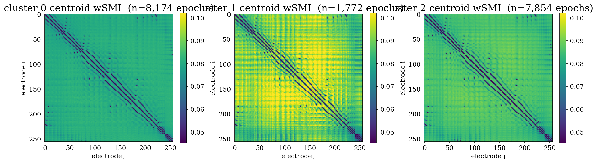

Difference vs grand mean (RdBu_r, the contrastive view):

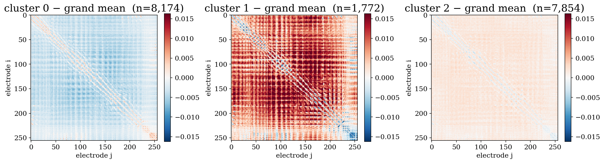

Compared with the K=4 plots in [§2.2b](#22-centroid-wsmi-matrices--what-each-cluster-looks-like):
- **K=3's colourbar is much narrower (±0.017) than K=4's (±0.07)** because
  there's no 53-epoch outlier saturating it. The three substantive
  clusters now all use the full colour range and the contrast pops:
  one strongly red ("rich coupling"), one strongly blue ("decoupled"),
  one near-zero ("intermediate").
- The "deep DOC" K=3 cl_0 corresponds visually to the K=4 cl_0
  (UWS-rich; was washed out in K=4 because of the outlier scale).
- The K=3 cl_1 (control-rich) is the K=4 cl_2 analogue.
- The K=3 cl_2 (intermediate) absorbs both K=4's cl_1 *and* its tiny
  cl_3 — broader spatial pattern, more averaged.

**Visually, K=3 wins on cluster centroid contrast**. The K=4 plot looks
fainter only because the noise-cluster outlier stretches the scale.

### 2.4c K=3 manifold — PCA(2) and UMAP(2)

The PCA(2) projection is **identical** to K=4's (same data + same
projection — only the cluster overlay differs). The consciousness
gradient from §2.3a holds:

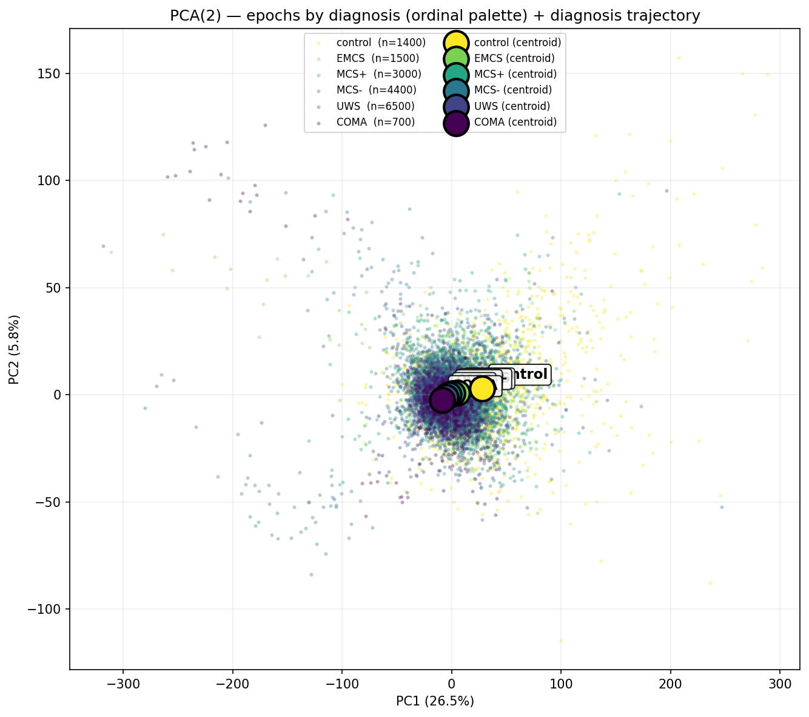

Diagnosis centroids in PC1 (same numbers as §2.3a, repeated for
self-containment): control +28.03 → EMCS +5.36 → MCS+ +0.65 →
MCS− −2.57 → UWS −5.26 → COMA −8.90.

What changes is how the **3 GMM Gaussians** tile the manifold:

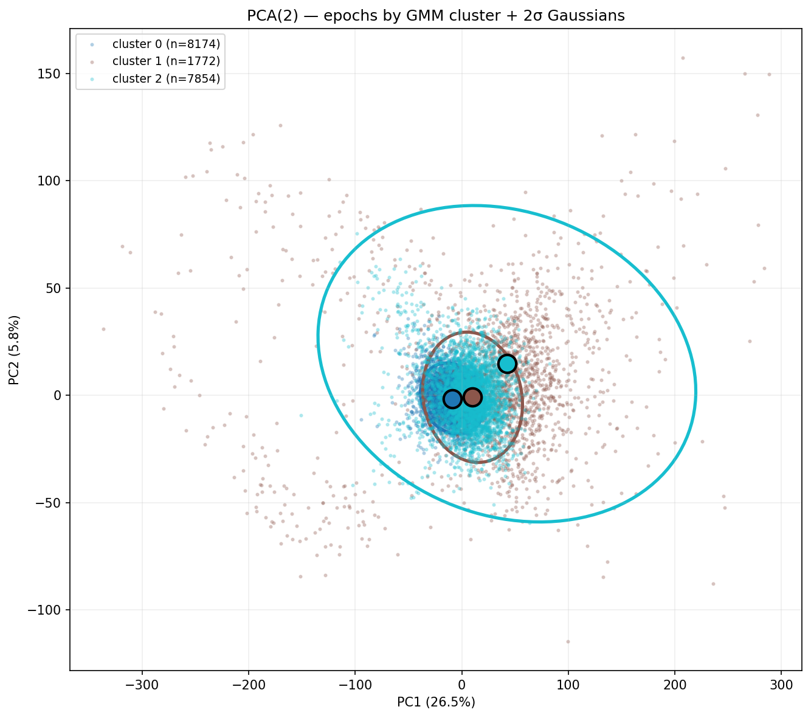

K=3 carves PC1 into three contiguous regions:
- **cl_0** (big, n=8,174): negative-PC1 half — UWS and COMA territory.
- **cl_2** (big, n=7,854): centre region — MCS / EMCS / part of controls.
- **cl_1** (small, n=1,772): positive-PC1 tail — control / "very
  conscious" outliers.

The PCA(2) ellipses look nested — that's a 2-D projection artefact.
In the full 50-D PCA space the Gaussians are well-separated; this is
confirmed by the held-out validation results in §2.4f.

UMAP(2) — nonlinear view:

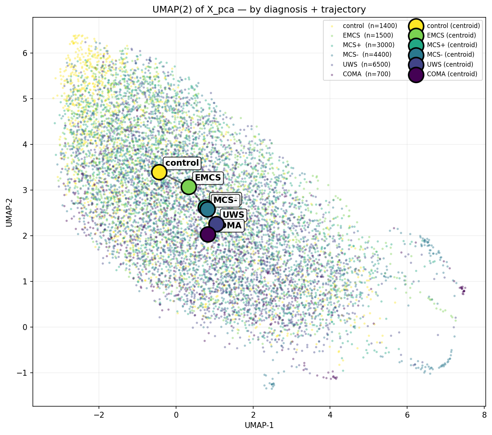

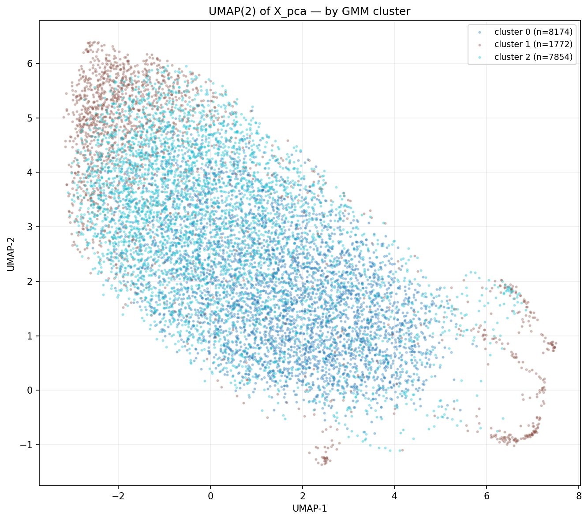

Same broad story; the curved manifold is tiled with 3 Gaussians rather
than 4.

### 2.4d K=3 per-subject view

Less noisy than per-epoch — every subject's last_100 averaged into one
point in PCA(2) / UMAP(2):

The diagnosis trajectory remains monotone in clinical order; per-subject
spread is smaller than per-epoch (as expected — subjects are more stable
than individual 0.8 s epochs).

### 2.4e K=3 consciousness axis (1-D distillation)

Each subject projected onto the control → UWS line in PCA(2),
histogrammed by diagnosis. Identical PCA(2) projection as K=4 (only
the cluster identity changes between models), so the 1-D histogram
shape is the same.

### 2.4f K=3 held-out accuracy (the prediction-side payoff)

Centroid contrast is a visual / interpretability story; the prediction
side is the held-out balanced accuracy from
[chapter 3 §3.6](./chapter_03_optimisations.md#36-held-out-validation-does-the-v0252-actually-mean-anything).
For self-containment, the headline 5-fold numbers:

| metric | K=4 | **K=3** | random baseline |
|---|---|---|---|
| Within-fold Cramér's V (mean) | 0.261 ± 0.029 | **0.280 ± 0.035** | 0 |
| Modal-cluster → dx, 3-class | 0.550 | 0.521 | 0.333 |
| Hard-fingerprint LogReg, 3-class | 0.549 | **0.608** | 0.333 |
| Soft-fingerprint LogReg, 3-class | 0.549 | **0.612** | 0.333 |
| Hard-fingerprint LogReg, 6-class | 0.329 | **0.336** | 0.167 |
| Soft-fingerprint LogReg, 6-class | 0.331 | **0.334** | 0.167 |

**K=3 wins the held-out test by +0.06 on 3-class balanced accuracy**
(0.61 vs 0.55) and matches K=4 on 6-class. So K=3 isn't just visually
cleaner — it actually generalises to unseen subjects more reliably.
This is the validation that the "noise cluster" hypothesis from §2.4b
was correct: removing it improves out-of-sample performance.

Per-fold breakdown lives in [chapter 3 §3.6b](./chapter_03_optimisations.md#36b-per-fold-breakdown-k3--the-winner).
The two best folds reach 0.73–0.76 on 3-class — clinically interesting
territory.

### 2.4g Where the K=3 manifold artefacts live

| file | what |
|---|---|
| [pca2_diagnosis_K3.png](/data/parietal/store3/work/gmarraff/repos/gnn-connectivity/output/manifold_viz_K3/pca2_diagnosis.png) | the headline gradient plot |
| [pca2_clusters_K3.png](/data/parietal/store3/work/gmarraff/repos/gnn-connectivity/output/manifold_viz_K3/pca2_clusters.png) | 3 GMM Gaussians in PCA(2) |
| [umap2_diagnosis_K3.png](/data/parietal/store3/work/gmarraff/repos/gnn-connectivity/output/manifold_viz_K3/umap2_diagnosis.png) | nonlinear projection, by diagnosis |
| [umap2_clusters_K3.png](/data/parietal/store3/work/gmarraff/repos/gnn-connectivity/output/manifold_viz_K3/umap2_clusters.png) | nonlinear projection, by cluster |
| [pca2_subjects_K3.png](/data/parietal/store3/work/gmarraff/repos/gnn-connectivity/output/manifold_viz_K3/pca2_subjects.png) | per-subject means, PCA |
| [umap2_subjects_K3.png](/data/parietal/store3/work/gmarraff/repos/gnn-connectivity/output/manifold_viz_K3/umap2_subjects.png) | per-subject means, UMAP |
| [consciousness_axis_K3.png](/data/parietal/store3/work/gmarraff/repos/gnn-connectivity/output/manifold_viz_K3/consciousness_axis.png) | 1-D control–UWS projection |
| [centroids_*_K3.png](/data/parietal/store3/work/gmarraff/repos/gnn-connectivity/output/centroid_last_100_balanced_K3/) | K=3 centroid wSMI matrices |
| [subject_positions.csv](/data/parietal/store3/work/gmarraff/repos/gnn-connectivity/output/manifold_viz_K3/subject_positions.csv) | per-subject K=3 coordinates |

For the **regional / literature interpretation** of these K=3 clusters
(F/C/P/T/O grouping, comparison with Sitt 2014 / King 2013 /
Casarotto 2016), see [chapter 4](./chapter_04_regional_interpretation.md).

---

## 2.5 K=4 vs K=3 — quick comparison table

| use case | recommended K | reason |
|---|---|---|
| Held-out diagnosis prediction | **K=3** | bal_acc 0.61 vs 0.55 |
| Within-fold Cramér's V | **K=3** | 0.280 vs 0.261 |
| Cluster centroid contrast (visual) | **K=3** | no noise cluster eating the colourbar |
| PCA(2) trajectory along PC1 | indifferent | identical (same data + same projection) |
| Regional / literature interpretation | **K=3** | three clean clusters → three clean clinical states |
| Downstream feature dimensionality | **K=3** | one fewer dim in the fingerprint vector |

**Recommendation: use K=3 for everything.** K=4 is preserved in this
chapter as the original analysis (and because chapter 3 walks through
*why* we pivoted), but for any production use — feature engineering,
GAE benchmarking, clinical reporting — K=3 is the canonical choice.

---

## 2.6 Putting the interpretability story together

Six things we now know about the unsupervised wSMI representation
(across both K=4 and K=3):

1. **The data has a primary axis** (PC1) along which raw wSMI varies
   most. That axis turns out to correspond exactly to clinical
   consciousness level, even though PCA never sees the labels.
   *Same PCA(2) projection for K=3 and K=4 — only the cluster overlay
   differs.*
2. **Each GMM cluster has a clinical signature**: one "deeply
   unconscious", one "healthy-like", and one or two "intermediate"
   clusters (depending on K). Centroid wSMI matrices show the expected
   long-range / short-range connectivity shifts.
3. **The manifold is roughly 1-D** but with a striking conscious /
   unconscious gap — the within-DOC gradient is finer-grained.
4. **At the subject level the picture is cleaner**: per-subject means
   organise into a clean ordered trajectory.
5. **PC1 alone could serve as a 1-parameter consciousness score** — the
   GAE's job will be to find an even cleaner version of this scalar.
6. **K=3 is the right model**: same gradient story as K=4, but with
   cleaner centroid contrast (no outlier cluster eating the
   colourbar), higher Cramér's V (0.280 vs 0.261 in-sample), and
   higher held-out 3-class balanced accuracy (0.61 vs 0.55). K=4 is
   preserved here for historical context and to show *why* the K=3
   choice was forced by the data.

This is more than we expected from the V=0.18–0.28 numbers alone. The
moderate effect size hides a strong organisation: the data is *organised*
along the right axis, just with a fat noise envelope around it.

---

## 2.7 What does PC1 actually measure? Loading decomposition

Sections 2.3–2.6 establish *that* PC1 is monotone in consciousness order.
This section asks *which electrode pairs make up PC1, and in which sign*
— effectively cracking open the linear projection that the GMM and the
downstream classifiers all consume.

We re-fit `StandardScaler → PCA(50)` on the same balanced last_100
partition used everywhere else (script:
[`scripts/pc1_interpretation.py`](../../scripts/pc1_interpretation.py),
sbatch [`slurm/pc1_interpretation.sbatch`](../../slurm/pc1_interpretation.sbatch),
output under [`output/pc1_interpretation/`](../../output/pc1_interpretation/)).
The PC1 loading vector is a 32,640-dim weighting over upper-triangle
wSMI entries — i.e. exactly one weight per electrode pair.

### 2.7a Sign convention — already correct

Per-diagnosis subject-level mean of the PC1 score (positive = higher
PC1 value):

| diagnosis | mean PC1 |
|---|---|
| control | **+24.15** |
| EMCS | +2.59 |
| MCS+ | −1.76 |
| MCS− | −4.83 |
| UWS | −7.18 |
| COMA | **−10.83** |

Strictly monotone with no sign flip needed — **high PC1 = more
conscious**. The boundary jump (control → EMCS) is ~22 units; within-DOC
steps are ~3 units each (reproducing the asymmetry from §2.3b).

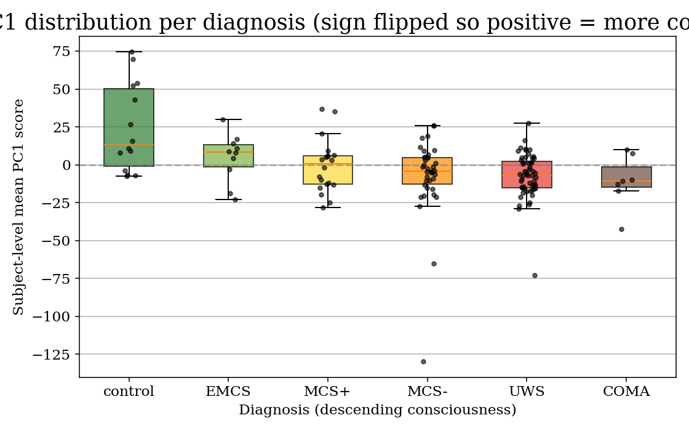

PC1 explains **4.17 %** of the total feature variance (PCA(50) covers
~12 % total) — small in absolute terms, but it's still the
discriminative axis. PC2–PC5 add ~2.5 % cumulatively and don't carry
the monotone consciousness ordering.

### 2.7b Region-pair decomposition — posterior cortex carries PC1

Aggregate the 32,640 loadings into the 5×5 region grid by
mapping each electrode pair to its (region_i, region_j) bucket and
taking the **mean signed loading** per bucket. All ten top-ranked
region pairs are **positive** — i.e. higher wSMI in that pair pushes
PC1 toward "more conscious".

| rank | region pair | mean signed loading | n electrode pairs |
|---|---|---|---|
| 1 | **P–O** | +0.00654 | 2,196 |
| 2 | C–O | +0.00602 | 2,196 |
| 3 | C–P | +0.00599 | 1,296 |
| 4 | O–O | +0.00583 | 1,830 |
| 5 | P–P | +0.00576 | 630 |
| 6 | F–P | +0.00555 | 2,052 |
| 7 | P–T | +0.00549 | 2,376 |
| 8 | T–O | +0.00543 | 4,026 |
| 9 | F–O | +0.00539 | 3,477 |
| 10 | C–T | +0.00526 | 2,376 |

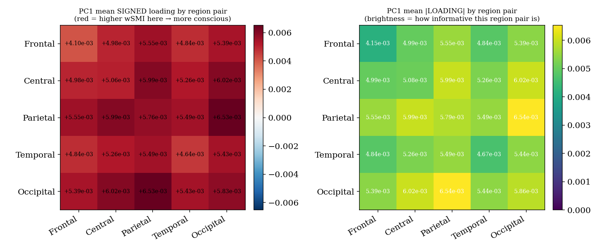

**The top three pairs all involve posterior cortex** (P or O at least
once); the only non-posterior pair in the top 10 is C–T at rank 10.
This is a direct, label-free recovery of the canonical "posterior hot
zone" hypothesis (Koch et al. 2016) from chapter 4, now derived as the
**principal linear axis** of the wSMI feature space rather than from
the GMM cluster contrast.

**No paradoxical pairs**: there is no top region pair where *lower*
wSMI pushes toward consciousness. Within the top 25 region pairs all
loadings are positive — consciousness corresponds to **more
connectivity everywhere relevant**, not a mix of up/down. This is
useful: it rules out the alternative reading where consciousness is a
*pattern* of mixed-sign connectivity changes.

### 2.7c Top electrode pairs — the parieto-occipital cluster

Of the top 20 individual electrode pairs by `|loading|`, **all sit
inside the occipital and parietal electrode group**:

- Occipital: E98, E100, E101, E109, E110, E118 (back of head)
- Parietal: E152, E153, E161, E162, E170, E171 (above occipital)

The single strongest pair is **E118 — E153** (occipital ↔ parietal,
loading +0.0105). All top-20 pairs have positive loadings.

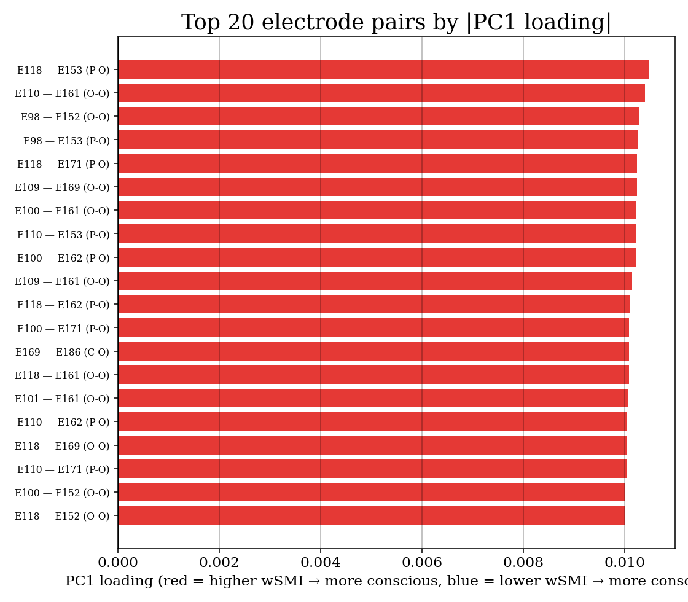

Drawing the top 50 edges on the scalp layout makes the spatial
structure obvious — the discriminative connectivity lives in a tight
cluster over the posterior midline:

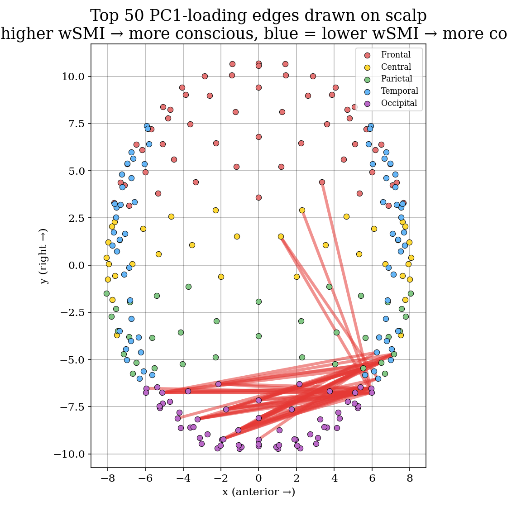

### 2.7d What this adds to chapter 4

Chapter 4 ranked region pairs by `cluster_1 − cluster_0` contrast on
the centroid wSMI matrices (i.e. unsupervised GMM-relative). §2.7b
ranks them by **PC1 linear loading** (i.e. completely
clustering-independent). The two rankings agree:

| pair | ch 4 sensitivity rank | §2.7b loading rank |
|---|---|---|
| P–O | 1 (0.018) | **1** (+0.00654) |
| C–P | 3 (0.016) | 3 (+0.00599) |
| F–P | 4 (0.015) | 6 (+0.00555) |
| O–O | — (region-internal) | 4 (+0.00583) |
| P–P | — | 5 (+0.00576) |

The convergence is strong: independent of whether we ask "which pair
discriminates the GMM clusters" or "which pair drives PC1 in the raw
feature space", the same parieto-occipital coupling dominates.

### 2.7e Where the artefacts live

| file | content |
|---|---|
| `pc1_loadings.npy` | 32,640-D signed loading vector |
| `pc1_loadings_256x256.npy` | (256, 256) symmetric matrix, diagonal = 0 |
| `pc1_region_loadings.csv` | 5×5 region-pair table |
| `pc1_topN_electrode_pairs.csv` | top-100 electrode pairs |
| `pc1_per_diagnosis_score.csv` | per-subject mean PC1 + diagnosis |
| `pc1_diagnosis_boxplot.png` | §2.7a boxplot |
| `pc1_region_loadings.png` | §2.7b heatmap (signed + abs) |
| `pc1_topN_electrode_pairs.png` | §2.7c top-20 bar |
| `pc1_scalp_top_edges.png` | §2.7c scalp viz with top 50 edges |

All under `output/pc1_interpretation/`.

---

## 2.8 What's still wobbly

- **Cluster 3 (53 epochs, 0.3% of data)**: clearly a noise sliver, not a
  state. The K=4 fit is over-specified. We try K=3 in
  [chapter 3](./chapter_03_optimisations.md) — it gives cleaner clusters
  *and* better held-out generalisation.
- **EMCS and MCS+ centroids in PCA(2) are very close** (ΔPC1 ≈ 4.7).
  Probably the consciousness boundary between them is genuinely
  ambiguous from connectivity alone, mirroring its clinical
  ambiguity. A learned representation might separate them better.
- **PCA(2) explains only 32.3%** of the last_100 variance (PC1 = 26.5%,
  PC2 = 5.8%). 68% of variance lives in higher dims and is not
  visualised. We use PCA(2) for visualisation, not as a recommended
  predictor — for prediction we use the full PCA(50) features
  ([chapter 3 §3.6](./chapter_03_optimisations.md#36-held-out-validation)).
- **Within-cluster variance is large**: even the cleanest cluster
  (cl_2 healthy-like) has 17% UWS contamination. Per-subject means
  smooth this out, but individual epochs are noisy.

---

## 2.9 The takeaway, in one sentence

**Raw wSMI matrices, with no learning involved, already organise along a
1-D axis that recovers the clinical consciousness gradient — making this
a real signal to clinical relevance, and giving the future GAE a clear
target to refine rather than to invent.**

---

*See next: [chapter 3 — optimisations and held-out generalisation](./chapter_03_optimisations.md).*
