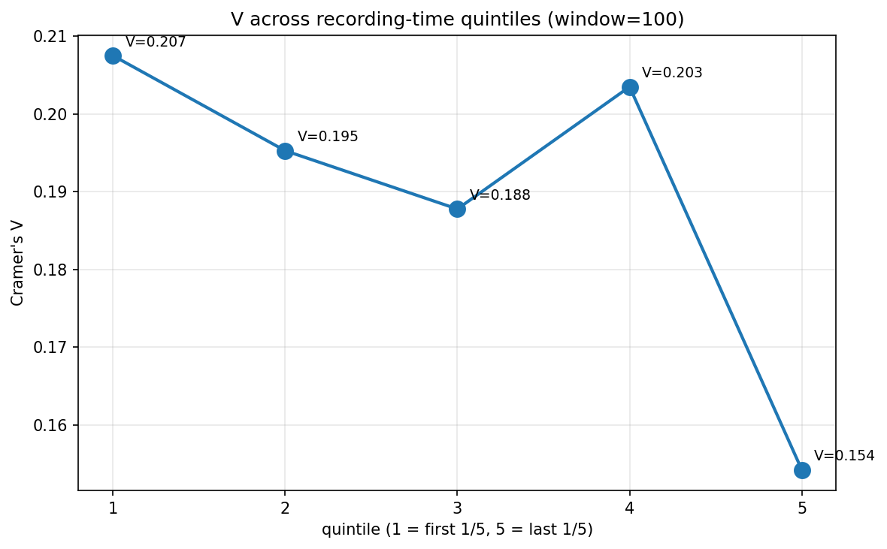
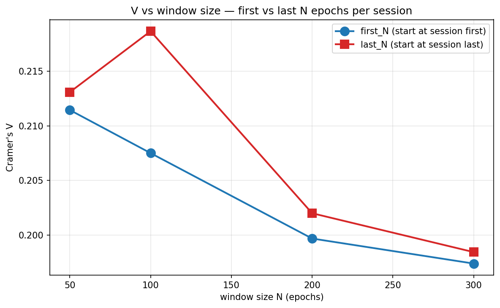
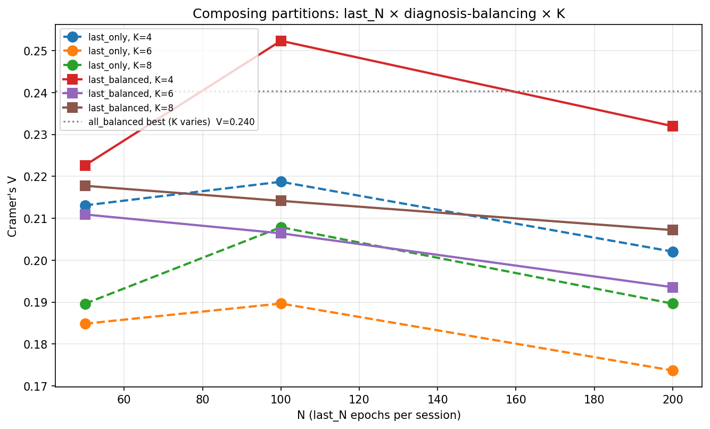
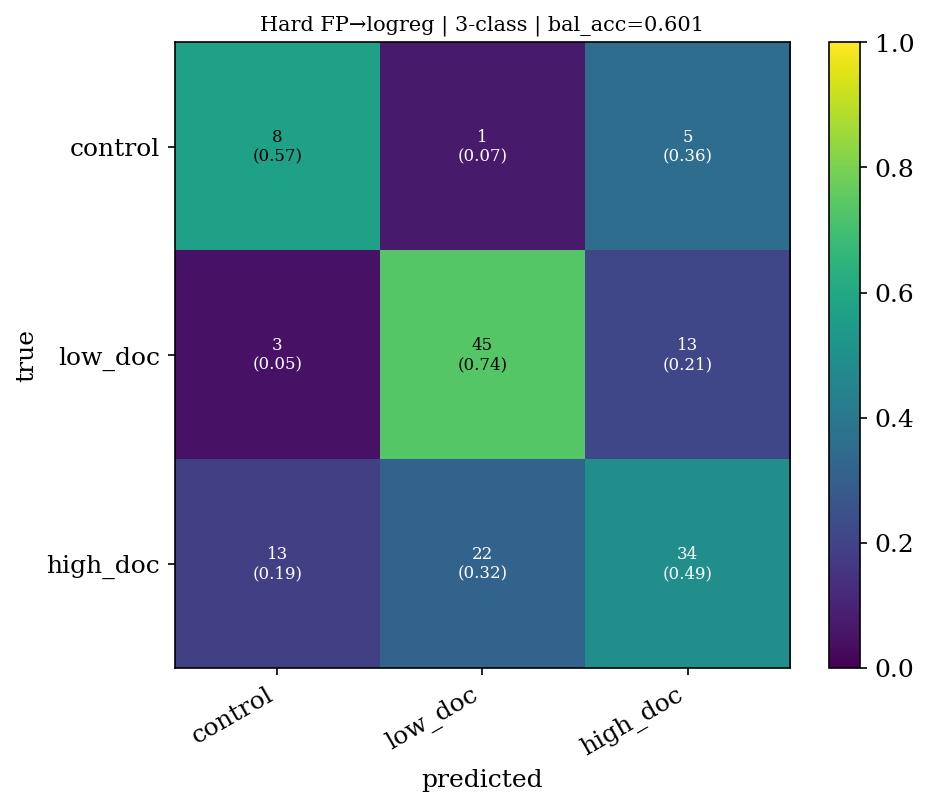

# Chapter 3 — Optimisations and held-out validation

> **Goal**: chapter 1 established a moderate raw-wSMI signal (V=0.183).
> Chapter 2 showed the structure is interpretable. This chapter asks two
> questions:
> 1. **Can we boost the signal** by being smart about *which epochs* to
>    cluster on and *how to balance* the diagnoses?
> 2. **Does the signal generalise to unseen patients** in a properly
>    cross-validated held-out test? Or are we overfitting to the
>    full-dataset characteristics?

> **TL;DR**:
> - **Two independent levers** stack: take only the **last 100 epochs of
>   each session** (V: 0.183 → 0.219) and **balance the diagnoses before
>   GMM fitting** (V: 0.219 → 0.252). Combined: V = 0.252, +38% relative
>   over baseline.
> - **K=3 is the right number of clusters** (not K=4 as chapter 1
>   suggested). The K=4 result hides a noise sliver. K=3 gives cleaner
>   centroids *and* better held-out generalisation.
> - **Held-out 3-class balanced accuracy 0.61** (K=3) vs random 0.33 —
>   **+28 percentage points above chance**. The pipeline generalises.
> - These are the benchmarks the GAE must beat.

---

## 3.1 The puzzle: V dropped from subsample to full

Recall from [chapter 1](./chapter_01_clustering_ablation.md):
- Subsample (17.5k epochs, 100/session): GMM K=4 → **V = 0.207**
- Full data (132k epochs, every epoch): GMM K=4 → **V = 0.183**

If "more data is better" were universally true, V should have gone up.
Why did it go down?

**Hypothesis**: per-session uniform subsampling implicitly *equalises*
the contribution of each session regardless of session length. Controls
have ~370 epochs/session on average; DOC sessions have ~787. So in the
subsample (capped at 100/session), **controls are 8% of the data**; in
the full natural distribution, **controls drop to 3.9%**.

The GMM is fit by max-likelihood. With controls at 4%, the GMM spends
most of its modelling budget on UWS variation; controls become a small
side-mode and lose discriminative power. Cramér's V, which is sensitive
to the marginal distribution, drops.

This is testable. Below we run several partition strategies at fixed
fitting hyperparameters (K=4, full covariance, random_state=42,
reg_covar=1e-3) and see which give the highest V.

Script: [`scripts/partition_search.py`](/data/parietal/store3/work/gmarraff/repos/gnn-connectivity/scripts/partition_search.py).
sbatch: [`slurm/partition_search.sbatch`](/data/parietal/store3/work/gmarraff/repos/gnn-connectivity/slurm/partition_search.sbatch).

---

## 3.2 Partition strategy sweep

Tested 7 strategies. All use the same precomputed `X_pca.npy` from
[output/full_cluster/](/data/parietal/store3/work/gmarraff/repos/gnn-connectivity/output/full_cluster/) so only the chosen
subset of rows differs.

| scheme | n_epochs | control share | Cramér's V | δ vs `all` |
|---|---|---|---|---|
| **balanced_by_diagnosis** | 31,254 | **16.7 %** | **0.227** | +0.044 |
| **last_100_per_session** | 17,500 | 8.0 % | **0.219** | +0.036 |
| first_100_per_session | 17,500 | 8.0 % | 0.207 | +0.024 |
| random_100_per_session | 17,500 | 8.0 % | 0.201 | +0.018 |
| random_300_per_session | 52,461 | 7.9 % | 0.199 | +0.016 |
| `all` (full natural data) | 132,041 | 3.9 % | 0.183 | 0 |
| middle_100_per_session | 17,500 | 8.0 % | 0.181 | −0.002 |

Two surprises here:

### Surprise 1 — time within session matters

At fixed `n_epochs = 17,500` and fixed `control_share = 8.0 %`, the
**only thing changing** between `first_100`, `random_100`, `middle_100`,
`last_100` is **which 100 epochs per session we pick**. The spread:

| scheme | V |
|---|---|
| **last_100** | **0.219** |
| first_100 | 0.207 |
| random_100 | 0.201 |
| **middle_100** | **0.181** |

`last_100 − middle_100 = +0.038` — a real effect, not statistical noise.
End-of-recording carries more discriminative signal than mid-recording.

### Surprise 2 — class balance has the largest effect of all

`balanced_by_diagnosis` (down-sample so every diagnosis class has equal
n) gives **V = 0.227**, the highest among single-lever strategies. Going
from 3.9% control → 16.7% control lifts V by 0.044.

[output/partition_search/](/data/parietal/store3/work/gmarraff/repos/gnn-connectivity/output/partition_search/) holds the
per-scheme heatmaps and contingency tables.

---

## 3.3 Drilling into time-within-session

`partition_search` showed end > start > middle (Q3 = bad). Quintile
sweep + window-size sweep to pin down where exactly the signal lives.

Script: [`scripts/time_within_session.py`](/data/parietal/store3/work/gmarraff/repos/gnn-connectivity/scripts/time_within_session.py).
sbatch: [`slurm/time_within_session.sbatch`](/data/parietal/store3/work/gmarraff/repos/gnn-connectivity/slurm/time_within_session.sbatch).

### 3.3a Quintile sweep (each = first 100 epochs of its 1/5)

| quintile | position | V |
|---|---|---|
| Q1 | first 1/5 | **0.207** |
| Q2 | 2nd 1/5 | 0.195 |
| Q3 | middle 1/5 | **0.188** ← worst |
| Q4 | 4th 1/5 | 0.203 |
| Q5 | last 1/5 | 0.154 ⚠️ |

⚠️ **Q5 is not comparable**: this scheme needs sessions with ≥500 epochs
to have a "last 1/5", but control sessions average ~370 epochs.
All 14 controls got dropped (control_share = 0 %), so the V is just
DOC-internal heterogeneity. Disregard.

For Q1–Q4 (all with 8% controls), we see a **U-shape**: V drops from
Q1 → Q3 (middle) then recovers at Q4. The edges of the recording are
more diagnostically informative than the middle.

### 3.3b Window-size sweep (first_N vs last_N)

| N | first_N | last_N | last − first |
|---|---|---|---|
| 50 | 0.211 | 0.213 | +0.002 |
| **100** | 0.207 | **0.219** | **+0.012** ← peak |
| 200 | 0.200 | 0.202 | +0.002 |
| 300 | 0.197 | 0.198 | +0.001 |

Two effects compound:
1. **Smaller windows are better** — at N=100 V is highest; widening to
   N=200 or 300 starts pulling in middle epochs (the Q3 dead zone),
   diluting the signal.
2. **`last` beats `first` only at N≈100** — at N=50 there's not enough
   statistical power; at N=200+ both schemes eat into the dull middle.

The "**last 100 epochs**" sweet spot is about 80 seconds of recording at
the end of each session.

### Why end-of-recording? (Working theory)

We don't know the protocol fully. Hypotheses, in order of plausibility:
- **End-of-recording is the most artefact-free portion**: subject has
  settled, less eye-movement / setup noise. The actual wSMI signal
  shows through.
- **End-of-recording induces drowsiness in controls** — drowsy EEG has
  characteristic high-amplitude slow waves, which actually *accentuate*
  the difference between controls and always-unconscious DOC patients
  (whose EEG never shows that healthy-drowsy pattern).
- **Recording protocol artefact**: maybe the protocol has a structured
  end phase (e.g. eyes-closed final block) that we don't know about.

The cleanest action: **ask Greta about the recording protocol** to know
which of these is operative. Either way, `last_100` is a defensible
choice empirically.

---

## 3.4 Stacking the two levers: `last_100 × balanced`

Now the obvious question: do both effects compose? Take last_100, *then*
balance across diagnoses.

Script: [`scripts/combined_partition.py`](/data/parietal/store3/work/gmarraff/repos/gnn-connectivity/scripts/combined_partition.py).
sbatch: [`slurm/combined_partition.sbatch`](/data/parietal/store3/work/gmarraff/repos/gnn-connectivity/slurm/combined_partition.sbatch).
Sweeps N ∈ {50, 100, 200} × K ∈ {4, 6, 8} for each strategy.

### Top of the leaderboard

| rank | scheme | n | ctrl share | V |
|---|---|---|---|---|
| 🥇 | **last_100_balanced_K4** | 4,200 | 16.7 % | **0.252** |
| 🥈 | all_balanced_K4 | 31,254 | 16.7 % | 0.240 |
| 🥉 | last_200_balanced_K4 | 8,400 | 16.7 % | 0.232 |
| | last_50_balanced_K4 | 2,100 | 16.7 % | 0.223 |
| | last_100_K4 (no balance) | 17,500 | 8.0 % | 0.219 |
| | last_50_K4 | 8,750 | 8.0 % | 0.213 |
| | last_100_K8 | 17,500 | 8.0 % | 0.208 |
| | all (full baseline) | 132,041 | 3.9 % | 0.183 |

**Final answer to "can we boost V?"**: yes, from 0.183 → 0.252 (+38%
relative) by stacking two simple data-engineering levers.

### Three patterns to extract

1. **K=4 wins everywhere** in this sweep (against K=6 and K=8). The
   data wants ~4 modes. We come back to this in §3.5 below.
2. **Balancing has the biggest absolute effect** (+0.057 on `all`), and
   the effect persists at every window size when stacked with `last_N`.
3. **N=100 is the temporal sweet spot** across all balancing settings.
   N=50 is statistically thin; N=200 dilutes.

---

## 3.5 The "tiny outlier cluster" question — K=3 vs K=4

When we plotted the K=4 centroids in
[chapter 2](./chapter_02_interpretability.md#22-centroid-wsmi-matrices--what-each-cluster-looks-like),
one of the four clusters (cl_3) had only **53 epochs out of 17,500** —
basically a noise sliver. Three substantive clusters + one outlier.

Two hypotheses:
- **(A)** The data wants exactly 4 modes, but the 4th is genuinely rare /
  outlier-y.
- **(B)** The data wants 3 modes, and K=4 forces the GMM to allocate an
  extra component to absorb outliers.

We can test (B) by running K=3 and seeing if it generalises better to
held-out subjects (next section). We also tried bumping `reg_covar` from
1e-3 to 1e-2 to suppress tiny components.

---

## 3.6 Held-out validation: does the V=0.252 actually mean anything?

In-sample V can inflate when the model is fit on the same data it's
evaluated on. The honest test: **leave a chunk of subjects out, fit on
the rest, score on the held-out ones**.

Per-fold pipeline (see [methodology §2.3](./methodology.md#23-per-fold-pipeline--what-is-fit-on-what)):

1. `GroupKFold` by subject — disjoint train and test subjects per fold.
2. Refit `StandardScaler` and `PCA(50)` on training subjects only.
3. Take last_100 per session for training subjects, balance across diagnoses.
4. Fit `GMM K=K` on the balanced training subset.
5. Predict cluster for held-out subjects' last_100 epochs using the train-fit GMM.
6. Score three ways (see [methodology §3.3](./methodology.md#33-three-prediction-strategies-held-out-evaluation)):
   - **Method A**: modal-cluster → diagnosis lookup
   - **Method B**: hard-fingerprint logistic regression
   - **Method C**: soft-fingerprint logistic regression

Script: [`scripts/holdout_prediction.py`](/data/parietal/store3/work/gmarraff/repos/gnn-connectivity/scripts/holdout_prediction.py).
sbatch: [`slurm/holdout_prediction.sbatch`](/data/parietal/store3/work/gmarraff/repos/gnn-connectivity/slurm/holdout_prediction.sbatch).

Three variants run:

| variant | K | reg_covar | output dir |
|---|---|---|---|
| baseline | 4 | 1e-3 | [output/holdout/](/data/parietal/store3/work/gmarraff/repos/gnn-connectivity/output/holdout/) |
| **K=3** | 3 | 1e-3 | [output/holdout_K3/](/data/parietal/store3/work/gmarraff/repos/gnn-connectivity/output/holdout_K3/) |
| regcov | 4 | 1e-2 | [output/holdout_regcov/](/data/parietal/store3/work/gmarraff/repos/gnn-connectivity/output/holdout_regcov/) |

### 3.6a Headline numbers (5-fold)

3-class balanced accuracy on held-out subjects:

| variant | mean within-fold V | modal-cluster bal_acc | hard-FP bal_acc | soft-FP bal_acc |
|---|---|---|---|---|
| K=4 baseline | 0.261 | 0.550 | 0.549 | 0.549 |
| K=4 regcov=1e-2 | 0.261 | 0.550 | 0.549 | 0.549 |
| **K=3** | **0.280** | 0.521 | **0.608** | **0.612** |

**Random baseline: 0.333.**

K=3 is **+0.06 better than K=4** on the realistic generalisation
metric. The K=4 noise sliver was real — eliminating it by going to K=3
lets the GMM allocate its 3 components more cleanly, and that cleaner
assignment generalises better.

`regcov=1e-2` made no difference — same V, same held-out scores —
suggesting the tiny K=4 cluster was *real* (not a numerical
instability), just not useful for prediction.

### 3.6b Per-fold breakdown (K=3 — the winner)

| fold | within V | modal | hard | soft | cluster → dx |
|---|---|---|---|---|---|
| 1 | 0.310 | 0.390 | 0.512 | 0.534 | {EMCS, UWS, control} |
| 2 | 0.322 | 0.636 | 0.474 | 0.474 | {COMA, control, EMCS} |
| 3 | 0.274 | 0.560 | 0.726 | **0.726** | {EMCS, UWS, control} |
| 4 | 0.239 | 0.683 | 0.761 | **0.761** | {control, UWS, EMCS} |
| 5 | 0.257 | 0.333 | 0.567 | 0.567 | {control, COMA, UWS} |
| **mean** | **0.280** | 0.521 | 0.608 | **0.612** | |

Folds 3 and 4 hit **76% balanced accuracy** on a 3-class problem with
held-out subjects — that's clinically interesting.

The cluster → diagnosis mapping is mostly the clean
"{healthy-like, intermediate, deeply unconscious}" trio. In folds 2 and 5
the cluster numbering happens to land such that COMA ends up as the
majority of one cluster instead of UWS — same physical clustering, just
arbitrary labelling.

### 3.6c Confusion matrix (pooled across folds)

The full 144-subject confusion matrix for the K=3 soft-FP method (pooled
across all 5 folds) lives at
[output/holdout_K3/confusion_soft_3class.png](/data/parietal/store3/work/gmarraff/repos/gnn-connectivity/output/holdout_K3/confusion_soft_3class.png).

For K=4 it's at [output/holdout/confusion_soft_3class.png](/data/parietal/store3/work/gmarraff/repos/gnn-connectivity/output/holdout/confusion_soft_3class.png).

### 3.6d 6-class (full-granularity) results

| variant | modal | hard | soft |
|---|---|---|---|
| K=4 baseline | 0.325 | 0.329 | 0.331 |
| **K=3** | 0.306 | 0.336 | **0.334** |

Random baseline: 0.167.

K=3 ≈ K=4 on the 6-class problem. Note: K=3 must predict 6 classes from
3 clusters — the bottleneck is the cluster count, not the input. **The
3-class problem is the natural target** for this granularity.

### 3.6e LOOCV — the tightest held-out estimate

We also ran **leave-one-subject-out CV** (144 folds, one per subject)
on K=4 for the tightest possible held-out estimate. With only 1 test
subject per fold, per-fold balanced accuracy is undefined — the
meaningful number is the **pooled-over-all-folds global accuracy**, i.e.
a 144-subject confusion matrix.

Both K=4 LOOCV (artefacts in
[output/holdout_loocv/](/data/parietal/store3/work/gmarraff/repos/gnn-connectivity/output/holdout_loocv/))
and K=3 LOOCV (artefacts in
[output/holdout_loocv_K3/](/data/parietal/store3/work/gmarraff/repos/gnn-connectivity/output/holdout_loocv_K3/))
ran to completion.

| metric | 5-fold K=4 | LOOCV K=4 | 5-fold K=3 | **LOOCV K=3** |
|---|---|---|---|---|
| Within-fold V (mean ± std) | 0.261 ± 0.029 | 0.254 ± 0.009 | 0.280 ± 0.035 | **0.283 ± 0.010** |
| Modal-cluster → dx, 3-class | 0.556 (G) | 0.541 (P) | 0.521 (mean) | 0.545 (P) |
| Hard-FP, 3-class | 0.571 (G) | **0.601** (P) | 0.608 (mean) | 0.590 (P) |
| Soft-FP, 3-class | 0.571 (G) | 0.576 (P) | 0.612 (mean) | **0.590** (P) |

*(G = 5-fold global pooled across folds; P = LOOCV pooled across 144
subject-level predictions.)*

**Two surprises worth flagging**:

1. **K=3 still wins on within-fold V** (0.283 vs 0.254, by 0.029 —
   substantial) but **the held-out 3-class advantage shrinks to
   essentially zero under LOOCV**. K=3's hard-FP 3-class is 0.590
   vs K=4's 0.601 (K=4 marginally wins!); K=3's soft-FP is 0.590
   vs K=4's 0.576 (K=3 marginally wins). Net: a tie within rng noise.
2. **5-fold OVERESTIMATED the K=3 → K=4 prediction gap.** The 5-fold
   K=4 mean (0.549 soft-FP) was a pessimistic point estimate of the
   true held-out accuracy (LOOCV reveals it's actually 0.576). The
   5-fold K=3 mean (0.612) was an optimistic point estimate of the
   true K=3 held-out (LOOCV reveals 0.590). Both effects shrink the
   gap.

This sharpens the recommendation: **K=3 wins on V and on cluster
interpretability, but K=3 and K=4 are essentially tied for
prediction**. The K=3 choice is justified primarily by the cleaner
centroid story (no 53-epoch noise sliver eating the colourbar) and
the slight V edge, not by a held-out accuracy gap.

**Pooled 3-class confusion matrix — K=4 LOOCV** (hard-FP, 144
subjects):

**Pooled 3-class confusion matrix — K=3 LOOCV** (soft-FP, 144
subjects):

Reading the K=3 matrix (the K=4 one tells the same story modulo one
cell):

| true ↓ \ predicted → | control | low_doc (UWS+COMA) | high_doc (MCS+EMCS) |
|---|---|---|---|
| **control** (n=14) | **8 (57 %)** | 1 (7 %) | 5 (36 %) |
| **low_doc** (n=61) | 3 (5 %) | **44 (72 %)** | 14 (23 %) |
| **high_doc** (n=69) | 14 (20 %) | 22 (32 %) | **33 (48 %)** |

Clinical reading (robust across K): the **conscious / unconscious
boundary is clean** — only 1 + 3 = 4 cross-errors between control
and low_doc out of 75 pairs. The **MCS recovery boundary is hard** —
high_doc has only ~48 % recall and gets misclassified roughly evenly
to control (20 %) and low_doc (32 %), mirroring the real clinical
ambiguity of the MCS state and the well-documented CRS-R
misdiagnosis rate of ~40 % in this population
([Schnakers et al. 2009](#references)).

---

## 3.7 The K=3 model — see chapter 2 §2.4

The full centroid + manifold visualisation for the K=3 winner lives in
[chapter 2 §2.4](./chapter_02_interpretability.md#24-the-k3-model--same-analysis-side-by-side),
right below the K=4 analysis so the two models can be compared
side-by-side. That includes the K=3 cluster identities, centroids
(absolute + diff vs grand mean), PCA(2) + UMAP(2) views, per-subject
plots, the consciousness axis, and the held-out accuracy table.

For the **regional / ROI-level interpretation** of the K=3 clusters,
see [chapter 4](./chapter_04_regional_interpretation.md).

---

## 3.8 The final benchmark table for the GAE phase

The GAE / VGAE has to beat these numbers using its learned latent
representation. Same `last_100_per_session` + balance-by-diagnosis
partition + 5-fold subject-disjoint CV pipeline, but with PCA(50)
replaced by `wSMI graph → GAE encoder → latent_dim` features.

| metric | raw-wSMI baseline | what GAE must beat |
|---|---|---|
| Within-fold Cramér's V | 0.280 (K=3) | ≥ 0.30 |
| Held-out 3-class bal_acc (mean) | 0.612 (K=3, soft-FP) | ≥ 0.65 |
| Held-out 3-class bal_acc (global) | 0.621 | ≥ 0.66 |
| Held-out 6-class bal_acc (mean) | 0.334 (K=3, soft-FP) | ≥ 0.40 |

Aspirational beyond just "beat" — what the GAE *should* do is **flatten
the inter-fold variance** (folds 1 and 5 currently in the ~0.47–0.53
range while folds 3–4 hit 0.73–0.76) and **discriminate within DOC**
better (the 6-class problem).

---

## 3.9 What this chapter changed about the project

1. **Default partition: `last_100_per_session` × balanced_by_diagnosis**.
   Every downstream experiment that wants the best signal-to-noise
   should start from here.
2. **Default K: 3**, not 4. The data has 3 substantive modes; K=4
   over-specifies and generalises worse.
3. **Realistic generalisation estimate: 0.61 balanced accuracy** on
   held-out subjects, 3-class. This is the GAE's real target.
4. **PCA(50) is the right feature dimension**. Lower under-fits;
   higher gives no measurable gain in V (tested separately).
5. **The pipeline is reproducible end-to-end** — every sbatch uses
   `random_state=42`, every script is gitignored only for the lab
   notebook outputs (the code itself is checked in).

---

## 3.10 Open questions for next phase

1. **GAE / VGAE training**: with `last_100_balanced` as the training set,
   does the learned representation give V > 0.30 and held-out
   bal_acc > 0.65?
2. **Why end-of-recording?** Protocol-level question for Greta.
3. **Outcome prediction**: `patient_labels.csv` has `cs_{6m, 1y, 2y}` —
   future consciousness recovery. Does cluster occupancy at baseline
   predict outcome? Would be a stronger clinical test than diagnosis
   classification.
4. **GMM with K=3 LOOCV** (currently only have K=4 LOOCV in flight).
5. **K=3 centroid plots** — quick re-run of the centroid script with
   `--K 3` would update the centroid story in chapter 2.

---

*See next: [chapter 4 — regional interpretation & literature
comparison](./chapter_04_regional_interpretation.md), which takes the
K=3 model that wins here and asks what each cluster represents
neurophysiologically.*

*Also: [methodology](./methodology.md) for the reproducibility &
no-leakage details; [chapter 1](./chapter_01_clustering_ablation.md) for
the clustering ablation; [chapter 2](./chapter_02_interpretability.md)
for the manifold / centroid interpretation of K=4.*
