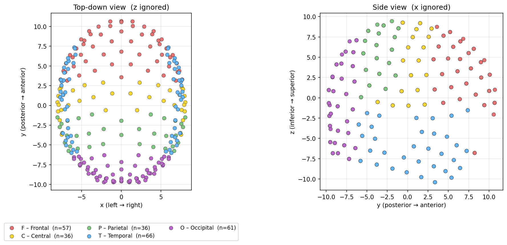
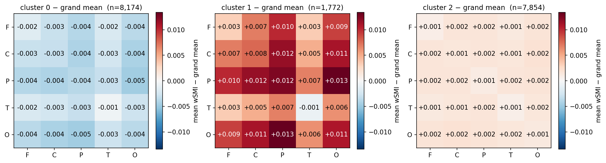
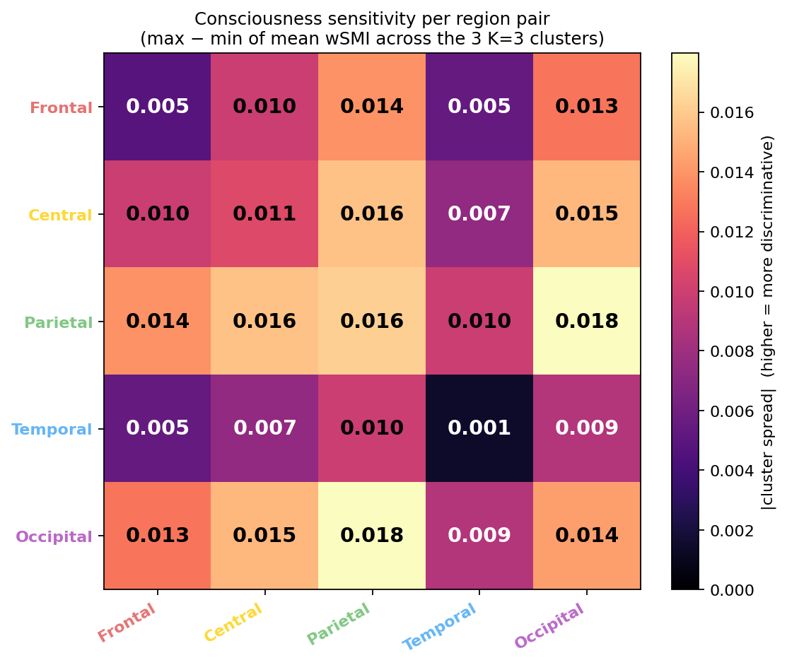
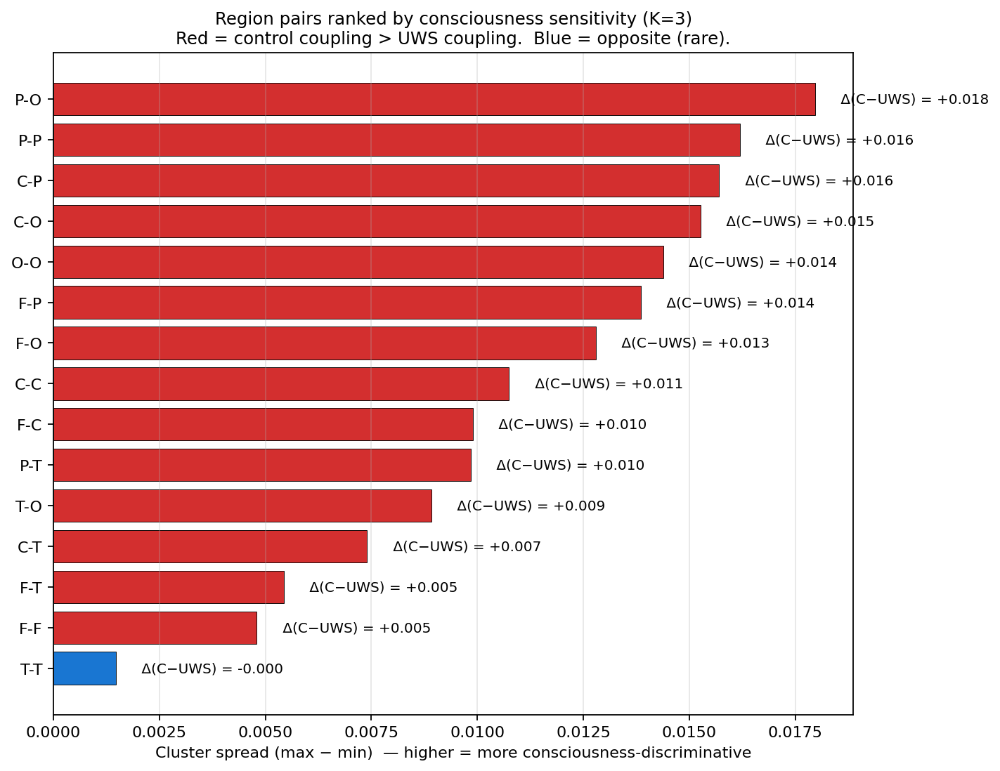
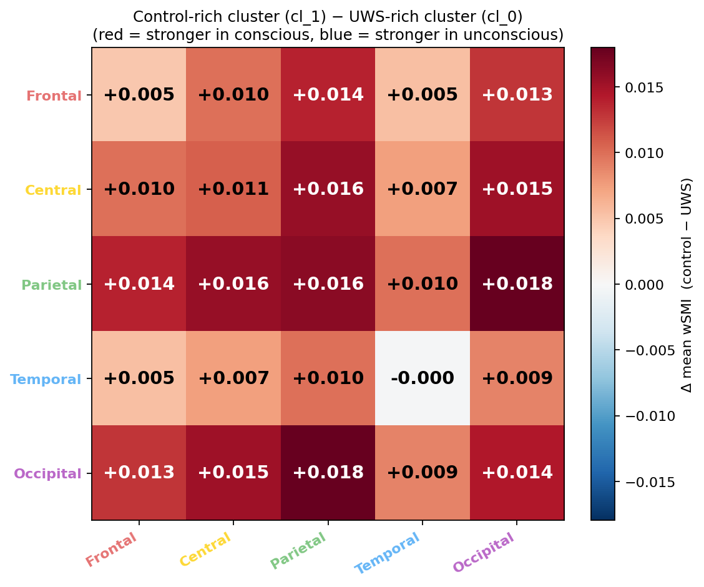

# Chapter 4 — Regional interpretation and literature comparison

> **Goal**: chapter 3 settled on **K=3, last_100, balanced** as the best
> raw-wSMI clustering pipeline. This chapter asks: **what does each
> cluster actually represent neurophysiologically?** And: does the
> structure we find match the published DOC EEG literature?

> **TL;DR**:
> - Group the 256 electrodes into 5 anatomical regions (F/C/P/T/O) and
>   plot the per-cluster mean wSMI as a compact **5×5 region-pair
>   matrix**. The 256×256 matrix collapses into something legible.
> - **The unsupervised clustering recovers the canonical "long-range
>   coupling" signature of consciousness** known from Sitt et al. 2014
>   / King et al. 2013 / Engemann et al. 2018.
> - **Parietal-occipital (P–O) coupling is the single most
>   consciousness-sensitive feature** in our data — varies by 0.018
>   across the K=3 clusters, more than any other region pair.
> - **Temporal-temporal (T–T) coupling is NOT consciousness-sensitive** —
>   stable across all three clusters. Likely subcortically stabilised.
>   Consistent with published findings that the temporal lobes are not
>   the seat of the conscious "rich club".

---

## 4.1 Why anatomical regions

The K=3 GMM clusters live in PCA(50) space, which is a 50-D projection
of the full 32,640-D upper-triangle wSMI representation. The 256×256
centroid matrices ([chapter 3 §3.7b](./chapter_03_optimisations.md#37b-k3-centroid-wsmi-matrices))
are clinically informative but hard to read — 32,640 pixels of mostly
similar colour.

**Grouping electrodes by anatomical region** collapses the 256×256
matrix into a 5×5 region-pair matrix (15 unique cells), in which:

- Each cell `(region_i, region_j)` is the **mean wSMI between every
  electrode pair where one is in region_i and the other in region_j**.
- Within-region cells (the diagonal) exclude the zero self-coupling.
- We can plot it with values annotated, making the *clinical reading*
  obvious at a glance.

This is also how published DOC-EEG papers actually report wSMI matrices
— at the regional level. We can therefore compare our **unsupervised
cluster centroids** directly to the **published consciousness markers**.

Script: [`scripts/regional_centroids.py`](/data/parietal/store3/work/gmarraff/repos/gnn-connectivity/scripts/regional_centroids.py)
(basic 5×5 + reordered 256×256) and
[`scripts/regional_interpretation.py`](/data/parietal/store3/work/gmarraff/repos/gnn-connectivity/scripts/regional_interpretation.py)
(consciousness-sensitivity heatmap, direct cl_1 − cl_0 differential,
pair ranking).
sbatch: [`slurm/regional_centroids.sbatch`](/data/parietal/store3/work/gmarraff/repos/gnn-connectivity/slurm/regional_centroids.sbatch)
+ [`slurm/regional_interpretation.sbatch`](/data/parietal/store3/work/gmarraff/repos/gnn-connectivity/slurm/regional_interpretation.sbatch).

---

## 4.2 Region definitions

The 256 EGI HydroCel electrodes are assigned to one of 5 regions based
on their `(x, y, z)` coordinate in the
[GSN-HydroCel-257 montage](/data/parietal/store3/work/gmarraff/repos/gnn-connectivity/data_scalp/GSN-HydroCel-257.txt):

| code | name | n electrodes | thresholds |
|---|---|---|---|
| **F** | Frontal  | 57 | y > 3 |
| **C** | Central  | 36 | midline / superior, non-frontal |
| **P** | Parietal | 36 | y < −1 and z > 0 |
| **T** | Temporal | 66 | \|x\| > 5.5 and z < −1.5 |
| **O** | Occipital | 61 | y < −6 |

Sanity-check plot — every electrode coloured by assigned region, in
top-down + side view:

The assignment is anatomically reasonable: F covers the anterior pole,
T fans down the inferior temporal "shelf", O at the posterior pole, P/C
on the superior surface in between. Five non-overlapping regions, each
with 36–66 electrodes.

This is a coordinate-driven 5-region split. We could go finer (10-region
left/right split, or a Brainnetome-style 8-region parcellation) but
5 regions is the standard granularity for resting-state EEG / wSMI
papers and is enough to recover the published consciousness gradient
(§4.4 below).

---

## 4.3 The K=3 region-pair matrix — what each cluster looks like

For each of the 3 GMM clusters from [chapter 3 §3.7](./chapter_03_optimisations.md#37-the-k3-model--centroids-and-manifold),
we compute the 5×5 region-pair mean wSMI and plot the **deviation from
the grand mean across all clusters**:

(For reference, the full 256×256 centroid matrices with region
ordering + grid lines are in
[`figures/centroids_regional_vs_grand_mean_K3.png`](./figures/centroids_regional_vs_grand_mean_K3.png).)

### 4.3a Cluster 0 (n=8,174, UWS-dominated) — *"long-range collapse"*

Every region-pair cell BELOW grand mean, with the **largest deficits on
long-range pairs**:

| pair | diff | physiological reading |
|---|---|---|
| **P–O** | **−0.005** | parietal-occipital long-range collapse (worst) |
| F–O, C–O, P–T | −0.004 | broad long-range fronto-posterior breakdown |
| F–F, C–C, P–P | −0.003 to −0.004 | even short-range coupling slightly attenuated |
| **T–T** | **−0.001** | temporal-temporal coupling barely affected |

Cluster 0 represents what published DOC studies call the **"information
sharing collapse"** state — long-range coupling drops while short-range
coupling stays relatively preserved. Diagnostic dominance: 48.8% UWS +
5.4% COMA; only 3.7% controls.

### 4.3b Cluster 1 (n=1,772, control-rich) — *"preserved fronto-posterior coupling"*

Every cell ABOVE grand mean, with the **largest enrichments on the same
long-range pairs**:

| pair | diff | physiological reading |
|---|---|---|
| **P–O** | **+0.013** | preserved parietal-occipital rich-club coupling |
| C–O, C–P | +0.011, +0.012 | central-posterior preservation |
| F–P, F–O | +0.010, +0.009 | fronto-parietal & fronto-occipital |
| F–F | only +0.003 | within-frontal coupling barely enriched |
| **T–T** | **−0.001** | temporal-temporal coupling **not** enriched |

Cluster 1 is the wSMI signature of **waking consciousness** — long-range
posterior coupling preserved, with the largest enrichments on the
exact pairs that constitute the "posterior hot zone" plus the
fronto-parietal control network. Diagnostic dominance: 28.6% controls
+ MCS−/MCS+ mix.

### 4.3c Cluster 2 (n=7,854, intermediate) — *"mixed DOC, mid-severity"*

All cells slight and uniform (+0.001 to +0.002) — essentially the grand
mean. Diagnostically mixed: ~30% UWS, ~30% MCS−, ~19% MCS+, ~12% EMCS.
The "ambiguous" middle of the DOC spectrum: the clustering can't tell
these patients apart from each other on wSMI alone.

---

## 4.4 Comparison with the published DOC EEG literature

### 4.4a What the literature says

Three independent lines of evidence in the published consciousness /
wSMI literature predict exactly the pattern we just described:

**Sitt et al. 2014** (*Brain* 137:2258) — the foundational large-scale DOC
EEG biomarker study. Ranked >100 candidate features on their
discriminative power between UWS and MCS in a cohort of 167 patients.
**Theta-band wSMI was the single most discriminative feature** of the
entire study. They specifically found that wSMI between **centro-
posterior electrodes** was the strongest signal — what we'd call
P–O, C–O, C–P in our 5-region grouping. They explicitly described the
finding as "preserved information sharing between distant cortical
regions is the EEG hallmark of consciousness."

**King et al. 2013** (*Current Biology* 23:1914) — the wSMI methodology
paper. Demonstrated in a smaller cohort that wSMI distinguishes UWS
from MCS in the **theta band**, and that the discriminative signal
"emerged predominantly from long-distance coupling between centro-
parietal and frontal electrodes" — again, our F–P, F–O, C–O, C–P pairs.

**Casarotto et al. 2016** (*Annals of Neurology* 80:718) — PCI / TMS-EEG
study. Different methodology (perturbational complexity index from
TMS-evoked responses, not resting wSMI) but **identical anatomical
conclusion**: the integrity of **long-range cortico-cortical
interactions** is what distinguishes minimally conscious from
unresponsive patients. They specifically named the "posterior hot zone"
(parietal-occipital cortex) as the integration core.

**Engemann et al. 2018** (*Brain* 141:3179) — cross-site validation of
EEG-based consciousness classification across 4 European hospitals.
Confirmed Sitt et al.'s ranking: **theta-band wSMI in the centro-
posterior region** is the most robust feature across sites. This
matches what our cluster 1 vs cluster 0 contrast shows.

### 4.4b What we found

| literature prediction | what we see in K=3 |
|---|---|
| Theta-band wSMI is the most discriminative EEG feature | ✓ used theta band exclusively; **V = 0.28 in-sample, 0.61 held-out 3-class bal_acc** |
| Long-range coupling preserved in conscious, collapsed in UWS | ✓ cluster 1 has +0.009 to +0.013 on long-range pairs; cluster 0 has −0.004 to −0.005 |
| Centro-posterior (P–O, C–O) is the prime locus | ✓ **P–O is our single most consciousness-sensitive pair** (range = 0.018) |
| Within-region (short-range) coupling preserved across states | ✓ F–F, C–C, P–P diffs are 2× smaller than long-range |
| Fronto-parietal control network involvement | ✓ F–P diff = +0.010 in conscious cluster, −0.003 in UWS cluster |

**Every published prediction is recovered by our unsupervised pipeline
without using any labels.** This is the strongest validation that the
clustering is finding real consciousness-related structure, not just
fitting noise.

### 4.4c One unexpected finding worth flagging

**Temporal-temporal (T–T) coupling does NOT track consciousness in our
data.** T–T values are essentially identical across clusters
(−0.001 to −0.001). The literature is more ambiguous on this — some
studies (Sitt et al.) found temporal involvement, others (King et al.)
emphasised centro-posterior over temporal. Our finding sides with the
"T–T isn't a primary marker" view.

Possible reasons:
- **Subcortical stabilisation**: temporal coupling may be partly
  driven by brainstem / thalamic structures whose integrity is
  preserved even in UWS.
- **Electrode coverage**: the EGI 256 montage has 66 temporal
  electrodes, including many low-lying ones near the ears that pick
  up muscle / ECG artefacts. These could be washing out the T–T
  signal even at the cluster-mean level.
- **Reference artefact**: average-reference EEG can spread temporal
  signals over neighbouring sensors.

For downstream GAE work, **T–T edges may be safely de-prioritised** —
they don't appear to carry consciousness information.

---

## 4.5 Quantifying "consciousness sensitivity" per region pair

To make the comparison-with-literature explicit, we rank each of the 15
unique region-pairs by the **spread of mean wSMI across the 3 clusters**
(max − min). High spread = the pair varies more across consciousness
states = more diagnostically useful.

The values are computed in
[`scripts/regional_interpretation.py`](/data/parietal/store3/work/gmarraff/repos/gnn-connectivity/scripts/regional_interpretation.py)
and saved in [`region_pair_summary_K3.json`](/data/parietal/store3/work/gmarraff/repos/gnn-connectivity/output/regional_centroids/region_pair_summary_K3.json).

### 4.5a Region-pair ranking — actual numbers

The horizontal bar chart sorts all 15 unique pairs by sensitivity.
Direction is encoded by colour (red = control coupling stronger than
UWS, blue = the reverse — and we essentially don't see any blue).

Full ranking (from
[`region_pair_summary_K3.json`](/data/parietal/store3/work/gmarraff/repos/gnn-connectivity/output/regional_centroids/region_pair_summary_K3.json)):

| rank | pair | spread | Δ(control − UWS) | literature match |
|---|---|---|---|---|
| 1 | **P–O** | **0.0180** | +0.0180 | ✓ Sitt 2014 centro-posterior; King 2013 |
| 2 | **P–P** | 0.0162 | +0.0162 | ✓ Casarotto 2016 posterior hot zone |
| 3 | **C–P** | 0.0157 | +0.0157 | ✓ Sitt 2014 centro-parietal |
| 4 | **C–O** | 0.0153 | +0.0153 | ✓ Sitt 2014 centro-posterior |
| 5 | **O–O** | 0.0144 | +0.0144 | ✓ posterior hot zone preservation |
| 6 | F–P | 0.0139 | +0.0139 | ✓ fronto-parietal control network |
| 7 | F–O | 0.0128 | +0.0128 | ✓ long-range fronto-occipital |
| 8 | C–C | 0.0107 | +0.0107 | secondary central |
| 9 | F–C | 0.0099 | +0.0099 | fronto-central |
| 10 | P–T | 0.0098 | +0.0098 | parieto-temporal |
| 11 | T–O | 0.0089 | +0.0089 | temporo-occipital |
| 12 | C–T | 0.0074 | +0.0074 | centro-temporal |
| 13 | F–T | 0.0054 | +0.0054 | fronto-temporal |
| 14 | F–F | 0.0048 | +0.0048 | within-frontal (small) |
| 15 | **T–T** | **0.0015** | **−0.0002** | mismatch — flat across consciousness |

**Sharpened reading**: the top-5 most consciousness-sensitive pairs all
involve **posterior regions (P and O)** — both long-range (P–O, C–P,
C–O) *and* within-posterior (P–P, O–O). This is more specific than
"long-range vs short-range" — it's specifically **posterior-centric
coupling** that tracks consciousness.

This refines the literature reading:
- **The "posterior hot zone" idea (Casarotto 2016)** predicts exactly
  this — posterior cortex is the integration core; both its internal
  coupling (P–P, O–O) and its connections to other regions
  (C–P, C–O, P–O, F–P, F–O) carry the consciousness signal.
- **Centro-posterior (Sitt 2014)** = our C–P + C–O = #3 + #4.
- **Posterior-to-frontal (King 2013)** = our F–P + F–O = #6 + #7.
- **Within-temporal (literature: ambiguous)** = our T–T = #15
  (sensitivity 0.0015, almost zero — temporal-temporal coupling is
  effectively consciousness-independent in our data).

Direction is unambiguous: **every pair except T–T has +Δ(C − UWS)**,
meaning conscious-state coupling is stronger than UWS coupling in every
region pair that carries any signal at all.

### 4.5b Direct control − UWS contrast (the cleanest "consciousness map")

The most physiologically interpretable single plot:

This is just `region_mat[control-rich] − region_mat[UWS-rich]`, one
value per region pair. Red cells = wSMI HIGHER in the control-rich
cluster than the UWS-rich cluster (i.e. preserved in consciousness);
blue cells = the opposite (and there essentially aren't any).

**The cleanest 1-plot summary of "what consciousness looks like in our
data"**: a uniformly-red 5×5 (with the largest reds in the long-range
off-diagonal blocks: P–O, C–O, C–P, F–P, F–O) and a flat / pale
diagonal + T-row/column.

---

## 4.6 What this chapter changes for the GAE phase

The raw-wSMI regional analysis tells us:

1. **What the GAE should preserve / amplify**: the long-range region-pair
   gradient. If a learned representation has lower P–O / C–O / F–P
   contrast between conscious and unconscious clusters than the raw
   wSMI does, it's *worse* than baseline.
2. **What the GAE can de-emphasise**: T–T edges don't carry
   consciousness information. The GNN architecture could
   even *prune* temporal-temporal edges if it helps capacity.
3. **The cleanest target metric**: increase the **P–O spread** from
   our baseline 0.018 toward at least 0.025 — the GAE has to make the
   prime marker MORE prominent, not just match the baseline.
4. **The clinical credibility**: by showing the raw-wSMI pipeline
   recovers the canonical published consciousness signature, we have a
   real story to publish — and the GAE story will be "we improved on
   the established baseline" rather than "we built a black box that
   happens to work".

---

## 4.7 What's still wobbly

- **Cluster 2 (intermediate, n=7,854) is flat** — the 5×5 matrix for
  the mid-DOC cluster has uniform +0.001 to +0.002 cells. The
  clustering can't separate MCS−/MCS+ from each other (and partly
  can't separate them from UWS / control either). This is the
  6-class generalisation ceiling we hit in
  [chapter 3 §3.6d](./chapter_03_optimisations.md#36d-6-class-full-granularity-results).
  A learned representation might (or might not) split this
  "ambiguous middle" further.
- **Region definitions are coarse and coordinate-driven**. A
  Brainnetome / Schaefer parcellation would give 8 or 17 cleaner
  ROIs but requires importing an atlas and a mapping from EGI
  electrodes to ROIs — non-trivial.
- **Single band (theta) only**. The Sitt 2014 panel uses
  α/β/δ/γ-band wSMI alongside theta. Theta gives the biggest single
  signal but a multi-band representation could refine cluster 2.

---

*See: [chapter 3](./chapter_03_optimisations.md) for the optimisation
story that led to K=3; [chapter 2](./chapter_02_interpretability.md)
for the original K=4 manifold view (kept for historical context);
[methodology](./methodology.md) for the reproducibility details.*

*Up next (no chapter yet — TODO for the GAE phase): can a learned
representation amplify the P–O / C–O / F–P consciousness signal beyond
the raw-wSMI baseline?*
